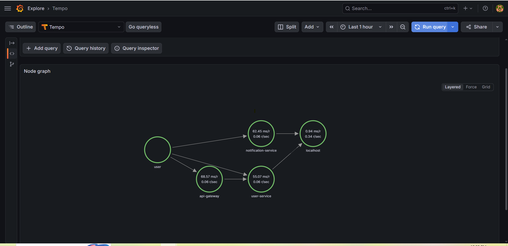
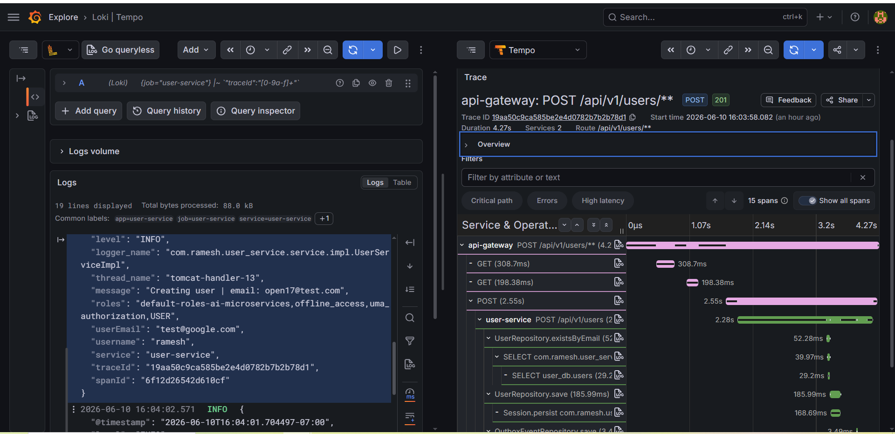
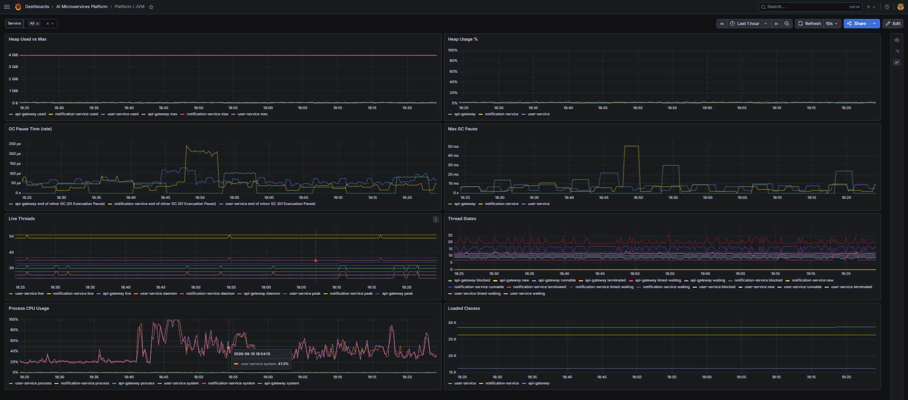
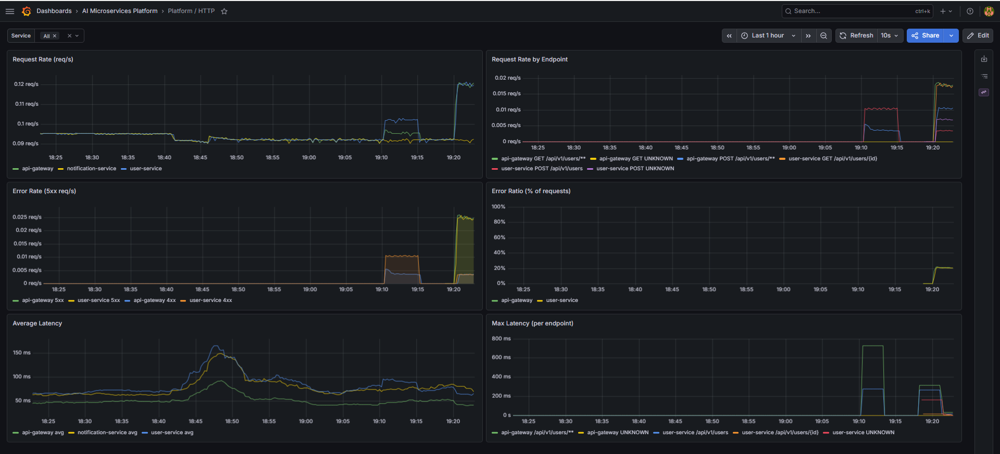
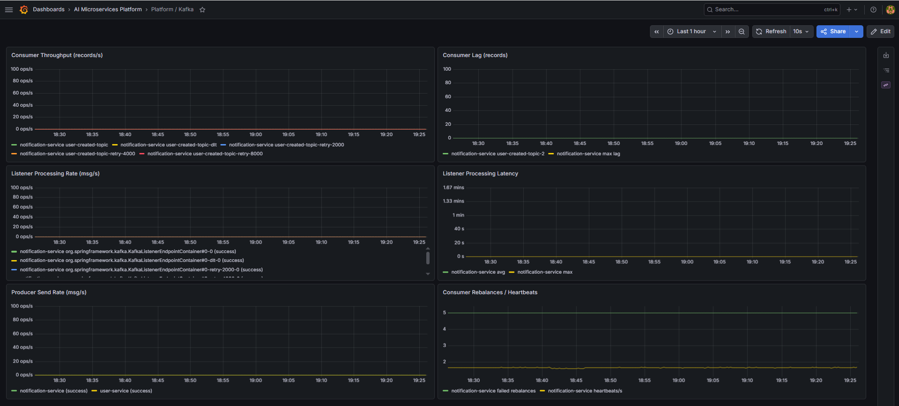
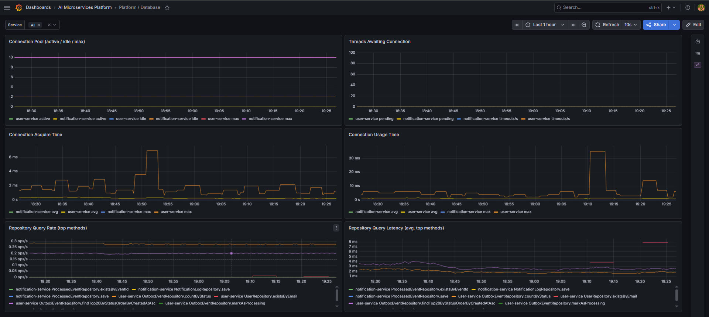
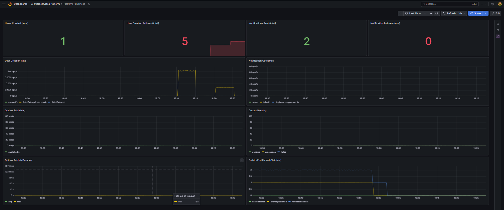
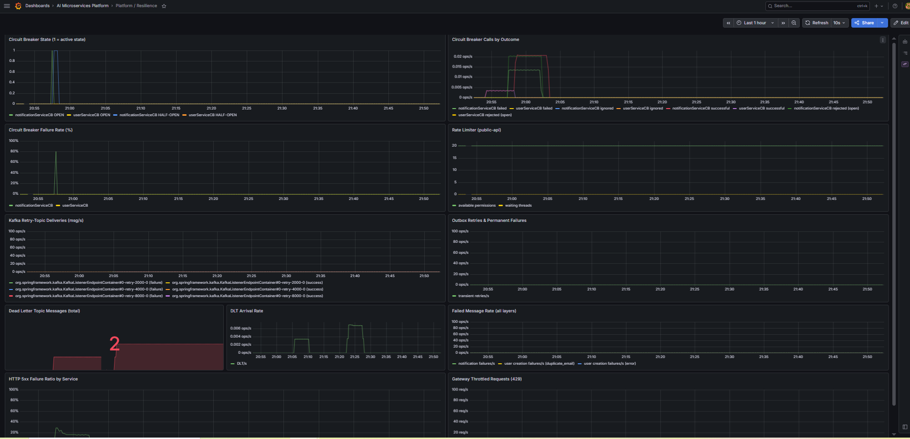

# AI-Driven Microservices Platform


An event-driven, cloud-native microservices platform designed to simulate real-world distributed systems using modern backend technologies.

This project demonstrates how independent services communicate asynchronously using Kafka, ensuring scalability, resilience, and loose coupling — similar to production-grade enterprise systems.

---

## 🎯 Project Goal

To design and implement a **real-world microservices ecosystem** that:

- Eliminates tight coupling between services
- Handles failures gracefully using retry & DLQ patterns
- Ensures data correctness under retries and duplicate events
- Processes events asynchronously at scale
- Demonstrates production-ready architecture patterns
- Can be deployed to AWS using containerized infrastructure

---

## 🧩 Core Use Case

A simplified distributed workflow:

1. **User Service**
   - Creates users
   - Persists data in MySQL
   - Stores `UserCreatedEvent` in an outbox table within the same database transaction
   - Publishes pending outbox events to Kafka through a scheduled publisher

2. **Notification Service**
   - Consumes events from Kafka
   - Applies idempotency checks
   - Sends notifications (currently simulated/logged)

3. **Future Extensions**
   - Payment Service
   - Analytics Service
   - AI Processing Service

---

## 🏗 Architecture Overview

- Event-driven communication using Kafka
- Schema-based messaging using Avro + Schema Registry
- API Gateway as a centralized entry point
- Independent deployable microservices
- Centralized contract management via `common-schema`
- Heterogeneous persistence strategy (MySQL + PostgreSQL)
- Containerized using Docker
- Reliable event delivery using Transactional Outbox Pattern
- End-to-end identity propagation and audit context tracking

> See architecture diagram below 👇


---
## API Gateway

Spring Cloud Gateway provides a centralized entry point into the platform.

### Responsibilities

- Request routing
- Correlation ID propagation
- Centralized observability
- Future JWT authentication
- Future rate limiting
- JWT authentication using Keycloak
- OAuth2 Resource Server
- Centralized authentication enforcement
- Identity propagation to downstream services (trusted `X-User-*` headers)

### Current Routes

| Route | Target Service |
|---------|---------|
| /api/v1/users/** | user-service |
| /api/v1/notifications/** | notification-service |
---

## 🔐 Authentication & Authorization

The platform uses Keycloak as the Identity and Access Management (IAM) provider.

### Features

- OAuth2 Resource Server
- JWT-based authentication
- Role-Based Access Control (RBAC)
- Centralized authentication at API Gateway
- Realm role extraction from Keycloak tokens
- Secure service access through Gateway

### Implemented Roles

| Role | Permissions |
|--------|--------|
| USER | Access user-facing APIs |
| ADMIN | Access user APIs and administrative APIs |

### Security Flow

```text
Client
   ↓
Keycloak Authentication
   ↓
JWT Access Token
   ↓
API Gateway
   ↓
JWT Validation
   ↓
Role Extraction
   ↓
RBAC Authorization
   ↓
Target Microservice
```

---

## 🪪 Identity Propagation & Audit Context

While the API Gateway authenticates the caller and enforces RBAC, downstream services historically had no knowledge of *who* triggered a request. The platform now propagates the authenticated identity end-to-end — across synchronous HTTP hops and asynchronous Kafka event flows — so every service, event, and persisted record retains the originating actor for auditing and traceability.

### How It Works

1. **Gateway** — after JWT validation, an `IdentityPropagationFilter` extracts the identity from the already-verified token (`preferred_username`, `email`, realm roles) and injects it as trusted headers (`X-User-Name`, `X-User-Email`, `X-User-Roles`). These headers are **always overwritten**, so a client cannot spoof its own identity.
2. **User Service** — an inbound filter rebuilds the identity into a thread-bound `IdentityContextHolder` and MDC. When a user is created, the actor and `traceId` are captured on the request thread and persisted **inside the same transaction** on the outbox row.
3. **Outbox Publisher** — the scheduled publisher reads the actor/trace context from the persisted outbox row (not from ThreadLocal, which is absent on the scheduler thread) and emits it as Kafka headers alongside the event.
4. **Notification Service** — the Kafka consumer rehydrates the actor from the inbound headers, re-binds it to the consumer thread + MDC, and persists it onto every `notification_log` and `dead_letter_event` record.

### Propagation Contract

| Transport | Identity Carrier |
|-----------|------------------|
| HTTP (Gateway → services) | `X-User-Name`, `X-User-Email`, `X-User-Roles` headers |
| Persistence (outbox) | `actor_username`, `actor_email`, `actor_roles`, `trace_id` columns |
| Kafka (user → notification) | `X-User-Name`, `X-User-Email`, `X-User-Roles`, `traceId` event headers |
| Audit records | `actor_*` columns on `notification_log` and `dead_letter_events` |

### Propagation Flow

```text
Keycloak JWT
      ↓
API Gateway (IdentityPropagationFilter → identity headers)
      ↓
User Service (IdentityContextHolder + MDC)
      ↓
Outbox Event (actor + traceId persisted in same transaction)
      ↓
Kafka Headers (actor + traceId)
      ↓
Notification Service (identity rehydrated onto consumer thread + MDC)
      ↓
notification_log / dead_letter_events (actor persisted)
```

### Features

- Trusted, spoof-resistant identity headers minted at the gateway
- Transport-agnostic `IdentityContext` reused across HTTP and Kafka
- Thread-bound `IdentityContextHolder` with strict `finally` cleanup (virtual-thread safe)
- Actor context captured transactionally with the outbox event
- Actor identity carried through Kafka headers, surviving retries and DLQ
- Durable audit trail: who triggered each notification and each dead-lettered event
- MDC enrichment so structured logs carry `username`, `email`, and `roles`

---

## 📝 Articles
| # | Article | Topics |
|---|---------|--------|
| 1 | [From Synchronous Calls to Event-Driven Microservices: Practical Lessons from Real Implementation](https://medium.com/@yara.ramesh/from-synchronous-calls-to-event-driven-microservices-practical-lessons-from-real-implementation-8e84c638e300) | Event-driven architecture, Kafka, Spring Boot, decoupling |
| 2 | [Idempotency in Distributed Systems: From Concept to Kafka Implementation](https://medium.com/@yara.ramesh/idempotency-in-distributed-systems-from-concept-to-kafka-implementation-68d453a05733) | Idempotency, @RetryableTopic, @DltHandler, duplicate prevention |
| 3 | [Observability in Event-Driven Microservices: Metrics, Dashboards, and Traceability](https://medium.com/@yara.ramesh/observability-in-event-driven-microservices-metrics-dashboards-and-traceability-774678de1e2c) | Prometheus, Grafana, Loki, Promtail, structured logging |
| 4 | [Why Database Transactions and Kafka Publishing Are Not Atomic](https://medium.com/@yara.ramesh/why-database-transactions-and-kafka-publishing-are-not-atomic-45923c390dd8) | Transactional Outbox Pattern, reliable event delivery, Micrometer |

---

## ⚙️ Key Architectural Principles

### 🔹 Loose Coupling
Services communicate via events instead of direct REST calls.

### 🔹 Resilience by Design
- Retry mechanisms
- Dead Letter Topics (DLT)
- Fault isolation between services

### 🔹 Data Integrity & Idempotency
- Ensures correctness under retries and duplicate message delivery
- Implements idempotent consumer pattern
- Prevents duplicate side effects (e.g., multiple notifications)

### 🔹 Scalability
Kafka enables independent horizontal scaling of producers and consumers.

### 🔹 Schema Evolution
Avro + Schema Registry ensures backward/forward compatibility.

### 🔹 Traceability
Correlation IDs are propagated across HTTP requests and Kafka events for end-to-end distributed request tracing.

### 🔹 Transactional Outbox
User creation and event persistence happen in the same database transaction. A scheduled outbox publisher later publishes pending events to Kafka, reducing the risk of losing events when database writes succeed but Kafka publishing fails.

---

## 📦 Project Structure

```
ai-microservices-platform/
│
├── api-gateway            # Spring Cloud Gateway
├── user-service           # Publishes user events (MySQL)
├── notification-service   # Consumes and processes events (PostgreSQL)
├── common-schema          # Shared Avro schemas
├── docker                 # Kafka + Schema Registry setup
├── docs                   # Architecture diagrams
```

---

## 🔄 Event Flow

```
Client Request
      ↓
API Gateway (JWT validation → inject identity headers)
      ↓
User Service (MySQL Transaction)
      ├── Save User
      └── Save Outbox Event (+ actor & traceId)
      ↓
Outbox Publisher
      ↓
Kafka Topic (event + actor & traceId headers)
      ↓
Notification Service (PostgreSQL)
      ↓
Idempotency Check → Process → Log Notification (+ actor)
```

---

## 🛠 Tech Stack

### Backend
- Java 21
- Spring Boot 4+
- Spring Kafka
- MapStruct
- Lombok
- OpenAPI / Swagger

### API Gateway

- Spring Cloud Gateway MVC

### Messaging
- Apache Kafka (KRaft mode)
- Confluent Schema Registry
- Avro

### Data
- MySQL (User Service)
- PostgreSQL (Notification Service)
- Flyway (Notification Service migrations)
- Liquibase (User Service migrations)

### DevOps & Infrastructure
- Docker
- Kubernetes (EKS - planned)
- Terraform (planned)
- GitHub Actions (CI)

### Observability
- Spring Boot Actuator
- Micrometer
- Prometheus
- Grafana
- OpenTelemetry Java Agent
- Grafana Tempo (distributed tracing)
- Service Map / Dependency Graph
- JVM metrics monitoring
- HTTP request rate monitoring
- Kafka consumer throughput monitoring
- CPU utilization tracking

---

## 🛡 Failure Handling Strategy

- Implemented retry using Spring Kafka `@RetryableTopic`
- Configured Dead Letter Topic (DLT) for failed events
- Added custom DLT handler for failure processing
- Ensures system resilience and fault isolation

---

## 🧩 Idempotent Consumer Strategy

- Implemented processed event tracking in Notification Service
- Uses unique `eventId` to detect duplicate events
- Stores processed events in PostgreSQL for persistence
- Applies application-level and database-level safeguards
- Prevents duplicate notifications under retry or re-delivery scenarios

---

## 📊 Observability Setup

The platform includes a local observability stack for monitoring distributed event-driven workflows and Kafka-based asynchronous communication.

### Observability Stack

- Spring Boot Actuator
- Micrometer
- Prometheus
- Grafana 
- Loki
- Promtail
- OpenTelemetry Java Agent
- Grafana Tempo (traces + service-graph metrics)

### Metrics Flow

```text
Spring Boot Services
        ↓
Actuator + Structured JSON Logs
        ↓
Prometheus Metrics Scraping + Promtail Log Shipping
        ↓
Prometheus + Loki
        ↓
Grafana Dashboards & Explore
```

### Dashboard Snapshot

Grafana dashboard providing visibility into:

- JVM Heap Memory Usage
- CPU Utilization
- HTTP Request Rate
- Kafka Consumer Throughput
- Transactional Outbox Health
- Event Publishing Metrics
- Outbox Processing Performance


### Monitored Metrics

Infrastructure Metrics

- JVM Heap Memory Usage
- CPU Utilization
- HTTP Request Rate
- Kafka Consumer Throughput

Transactional Outbox Metrics

- Pending Outbox Events
- Processing Outbox Events
- Failed Outbox Events
- Total Published Events
- Publish Rate (events/sec)
- Average Publish Duration

### Structured Logging

- Structured JSON logging using Logback
- OpenTelemetry `traceId`/`spanId` enrichment via MDC (agent-injected, zero code changes)
- MDC enrichment with actor identity (`username`, `email`, `roles`)
- Service-level contextual logging
- Correlation ID propagation across Kafka events
- Logs prepared for centralized aggregation with Loki/ELK

### Centralized Logging

The platform supports centralized log aggregation using Loki and Promtail for distributed debugging and cross-service traceability.


### Logging Flow

```text
Spring Boot Services
        ↓
Structured JSON Logs
        ↓
Promtail
        ↓
Loki
        ↓
Grafana Explore
```

### Features

- Centralized log aggregation
- Distributed traceId search across services
- Kafka workflow traceability
- Grafana Explore integration
- Structured JSON log ingestion

### Available Endpoints

```text
User Service:
http://localhost:8080/swagger-ui.html

Notification Service:
http://localhost:8081/swagger-ui.html

API Gateway:
http://localhost:8082/api/v1/users/**
http://localhost:8082/api/v1/notifications/**
http://localhost:8082/actuator/prometheus

Prometheus:
http://localhost:9090

Grafana:
http://localhost:3000

Loki:
http://localhost:3100

Promtail:
http://localhost:9080
```

---

## 🔍 Distributed Request Tracing

The platform supports end-to-end request traceability across synchronous HTTP requests and asynchronous Kafka event flows using correlation IDs and MDC-based logging.

### Tracing Flow

```text
Incoming HTTP Request
        ↓
API Gateway
        ↓
Gateway Correlation Filter
        ↓
User Service Logs
        ↓
Kafka Event Headers
        ↓
Notification Service Consumer
        ↓
Notification Processing Logs
```

### Features

- Correlation ID generation using `X-Correlation-Id`
- MDC-based contextual logging
- Kafka header trace propagation
- End-to-end trace visibility across services
- Thread-safe MDC cleanup for Kafka consumers
- Actor identity (`username`, `email`, `roles`) propagated alongside the trace ID

### Example Trace

```text
[user-service,traceId:trace-kafka-123]
[notification-service,traceId:trace-kafka-123]
```

---

## 🛰 OpenTelemetry Tracing & Service Map

Building on correlation-ID logging, the platform now emits **true distributed traces** using the **OpenTelemetry Java Agent**. The agent auto-instruments the HTTP, JDBC, and messaging layers with **zero application code changes**, exports spans over OTLP to **Grafana Tempo**, and stitches them into end-to-end traces via W3C `traceparent` context propagation.

### Tracing Pipeline

```text
Spring Boot Services (OpenTelemetry Java Agent)
        ↓  OTLP (http/protobuf :4318)
Grafana Tempo
        ↓
Grafana (Explore → Tempo → Search / Trace View)
```

Each service attaches the agent at `bootRun` and sets `otel.service.name`. The synchronous request path `api-gateway → user-service → MySQL` appears as a single connected trace in Tempo.

### Service Map / Dependency Graph

Service relationships are generated **automatically from trace data** — edges are never wired by hand. Tempo's **metrics-generator** derives service-graph metrics from spans and **remote-writes** them to Prometheus, which Grafana's Tempo data source queries to render the **Service Graph** (node graph) view.

```text
Tempo (service-graphs processor)
        ↓  traces_service_graph_* metrics (remote_write)
Prometheus (--web.enable-remote-write-receiver)
        ↓  queried via Tempo data source (serviceMap link)
Grafana → Explore → Tempo → Service Graph
```

**Configuration added:**

| File | Change | Purpose |
|------|--------|---------|
| `docker/tempo/tempo.yml` | `metrics_generator` + `overrides` enabling the `service-graphs` processor and remote-write to Prometheus | Generate service-graph metrics from spans |
| `docker/docker-compose.yml` | `--web.enable-remote-write-receiver` flag on Prometheus | Allow Tempo to remote-write metrics |
| `docker/grafana/provisioning/datasources/tempo.yml` | Prometheus data source + Tempo `serviceMap.datasourceUid` and `nodeGraph` | Render the dependency graph in Grafana |

**Verify the generated edges (Prometheus):**

```promql
traces_service_graph_request_total
```

Synchronous service relationships and database dependencies — e.g. `api-gateway → user-service`, `user-service → MySQL`, `notification-service → PostgreSQL` — appear as edges in Grafana's Service Graph.

> **Known limitation:** the asynchronous `user-service → notification-service` edge requires the Kafka producer and consumer spans to share a trace. The current OpenTelemetry Java Agent build does not emit Kafka messaging spans under the platform's Spring Boot version, so this messaging edge is not yet rendered. It is tracked as a follow-up (agent upgrade); synchronous HTTP and database edges are generated and visible today.

### Features

- Zero-code distributed tracing via the OpenTelemetry Java Agent
- OTLP span export to Grafana Tempo
- W3C trace-context propagation across HTTP hops
- Service Map / Dependency Graph generated automatically from trace data
- Tempo metrics-generator → Prometheus remote-write → Grafana Service Graph

### Service Graph Example

The service graph below is generated automatically from distributed trace data collected by OpenTelemetry and processed by Grafana Tempo.



---

## 🔗 Correlated Logging — Trace ↔ Log Navigation

Metrics, traces, and logs are now **cross-linked into a single debugging workflow**. Every structured JSON log line carries the active OpenTelemetry `traceId` and `spanId` (injected into the MDC by the OTel Java Agent — no application code changes), which lets Grafana pivot between Loki and Tempo in both directions:

- **Logs → Traces:** a Loki *derived field* extracts the `traceId` from the log line and renders a **View Trace** link that opens the full distributed trace in Tempo.
- **Traces → Logs:** Tempo's `tracesToLogsV2` link jumps from any span to the matching Loki log stream, time-shifted around the span and filtered by trace ID.

### Correlation Flow

```text
Structured JSON Log (traceId, spanId)          Tempo Trace (spans)
        │                                              │
        │  Loki derived field                          │  tracesToLogsV2
        │  "traceId":"(\w+)" → View Trace              │  span → service logs ±5m
        ▼                                              ▼
   Tempo Trace View   ◄────────────────────►   Loki Log Stream
```
### Trace ↔ Log Correlation

The screenshot below demonstrates bidirectional navigation between Loki and Tempo.

- Logs → Trace using View Trace
- Trace → Logs using Tempo trace links



### Configuration

| File | Change | Purpose |
|------|--------|---------|
| `*/logback-spring.xml` | `traceId` / `spanId` MDC fields in the JSON encoder | Embed OTel trace context in every log line |
| `docker/grafana/provisioning/datasources/tempo.yml` | Loki `derivedFields` (regex → internal link → Tempo UID) | Logs → traces navigation |
| `docker/grafana/provisioning/datasources/tempo.yml` | Tempo `tracesToLogsV2` (Loki UID, `service.name` tag mapping, ±5m time shift) | Traces → logs navigation |
| `docker/promtail/promtail-config.yml` | Removed `traceId` from the Promtail `labels` stage | Keep Loki label cardinality bounded — trace IDs are unbounded and would create one stream per request; the derived-field regex matches on **line content**, so no label is needed |

### Usage

In **Explore → Loki**, query for trace-bearing lines and expand a log row — the **View Trace** button appears under *Links*:

```logql
{job="user-service"} |~ `"traceId":"[0-9a-f]+"`
```

In **Explore → Tempo**, open any span and use the **logs** link to jump to the correlated Loki stream.

> **Known limitation:** log lines emitted on Kafka consumer threads and the `@Scheduled` outbox publisher currently log an empty `traceId` — OTel context is not yet propagated onto those threads (same root cause as the missing Kafka service-map edge). HTTP request-path logs are fully correlated today.

### Features

- OTel `traceId`/`spanId` embedded in structured JSON logs across all services
- One-click pivot from any log line to its distributed trace (Loki → Tempo)
- One-click pivot from any span to its correlated logs (Tempo → Loki)
- Cardinality-safe Loki ingestion (trace IDs kept out of stream labels)
- Provisioned as code — the entire correlation setup lives in version-controlled datasource provisioning

---

## 📊 Production-Grade Grafana Dashboards (Provisioned as Code)

The platform ships **five purpose-built Grafana dashboards**, provisioned entirely from version-controlled JSON — no hand-built panels, no click-ops. Dashboards land automatically in the **AI Microservices Platform** folder on startup and reload within 30 seconds of a file change.

```text
docker/grafana/provisioning/dashboards/
├── dashboards.yml          # file provider (folder, reload interval)
└── json/
    ├── jvm-dashboard.json        # Platform / JVM
    ├── http-dashboard.json       # Platform / HTTP
    ├── kafka-dashboard.json      # Platform / Kafka
    ├── database-dashboard.json   # Platform / Database
    └── business-dashboard.json   # Platform / Business
```

### Dashboard Catalog

| Dashboard | Scope | Key Panels |
|-----------|-------|------------|
| **Platform / JVM** | All services (templated `$service` variable) | Heap used vs max, heap %, GC pause rate & max pause, live threads, thread states, process/system CPU, loaded classes |
| **Platform / HTTP** | All services | Request rate (per service & per endpoint), 4xx/5xx error rate, 5xx error ratio, average & max latency |
| **Platform / Kafka** | Producer + consumer | Consumer throughput (records/s), consumer lag per partition, listener processing rate & latency, producer send rate, rebalances/heartbeats |
| **Platform / Database** | MySQL + PostgreSQL via HikariCP | Active/idle/max connections, pending threads & acquire timeouts, connection acquire/usage time, top-10 repository query rate & latency |
| **Platform / Business** | Domain KPIs | Users created, creation failures by reason, notifications sent/failed/duplicates suppressed, outbox publish rate & failures, outbox backlog, end-to-end funnel |

### Business Metrics (Custom Micrometer Instrumentation)

A metrics audit showed that JVM, HTTP, HikariCP, Spring Data, and Kafka client metrics were already exposed by Micrometer auto-instrumentation, and the transactional outbox was already instrumented (`outbox_*`). Phase 5 adds **only the missing business-layer counters**:

| Metric | Type | Service | Meaning |
|--------|------|---------|---------|
| `users_registered_total` | Counter | user-service | Successfully created users |
| `users_creation_failed_total{reason}` | Counter | user-service | Failed creations, split by `duplicate_email` vs `error` |
| `notifications_sent_total` | Counter | notification-service | Welcome notifications sent |
| `notifications_failed_total` | Counter | notification-service | Notification attempts that threw |
| `notifications_duplicate_total` | Counter | notification-service | Duplicates suppressed by the idempotent consumer (app-level + DB-constraint level) |
| `outbox_published_total` / `outbox_failed_total` | Counter | user-service | Outbox publish outcomes *(pre-existing)* |
| `outbox_pending` / `outbox_processing` / `outbox_failed` | Gauge | user-service | Live outbox backlog by lifecycle state *(pre-existing)* |
| `outbox_publish_duration_seconds` | Timer | user-service | Outbox publish latency *(pre-existing)* |

> **Naming note:** the "users created" counter is exposed as `users_registered_total` rather than `users_created_total` — OpenMetrics reserves the `_created` suffix, and the Prometheus client silently strips it (the metric would surface as `users_total`).

The **Business dashboard's funnel panel** correlates the three counters end-to-end: every `users_registered_total` increment should eventually produce one `outbox_published_total` and one `notifications_sent_total` — divergence between the three lines is an immediate signal of event loss, backlog growth, or consumer failure.

### Dashboard Screenshots







### Verifying the Setup

```bash
# 1. Business counters exposed by the services
curl -s localhost:8080/actuator/prometheus | grep -E "users_(registered|creation_failed)"
curl -s localhost:8081/actuator/prometheus | grep -E "notifications_(sent|failed|duplicate)_total"

# 2. Prometheus has scraped them
curl -s 'localhost:9090/api/v1/query?query=users_registered_total'

# 3. Dashboards provisioned (Grafana API)
curl -s -u admin:admin 'localhost:3000/api/search?tag=platform'
```

Then create a user (and repeat the same request once to trigger the duplicate-email path) and watch the Business dashboard panels move:

```bash
curl -X POST localhost:8082/api/v1/users -H "Authorization: Bearer $TOKEN" \
  -H "Content-Type: application/json" \
  -d '{"email":"demo@test.com","firstName":"Demo","lastName":"User"}'
```

---

## 🛡 Resilience & Reliability

The platform degrades gracefully and recovers automatically under three failure classes: **downstream service outages** (circuit breakers + fallbacks), **traffic surges** (edge rate limiting), and **message-processing failures** (layered retries ending in a dead letter topic). Every protection emits metrics into the existing Prometheus/Grafana stack.

### Resilience Architecture

```text
                 Client
                   │
                   ▼
        ┌─────────────────────────────┐
        │   API Gateway               │
        │   ① RateLimitFilter (429)   │  Resilience4j RateLimiter — 20 req/s,
        │   ② JWT validation          │  runs BEFORE security: floods are shed
        │   ③ CircuitBreaker filter   │  userServiceCB / notificationServiceCB
        │      └─ fallback → 503      │  fail-fast + Retry-After when open
        │   ④ Retry filter (GET 5xx)  │  idempotent reads only
        └──────────┬──────────────────┘
                   ▼
        user-service ──► outbox table ──► scheduled publisher
                                          ⑤ transient failure → PENDING again
                                            (outbox_retried_total, max 5 → FAILED)
                                          │
                                          ▼ Kafka
        notification-service  ⑥ @RetryableTopic: retry-2000 → retry-4000 → retry-8000
                              ⑦ exhausted → DLT → @DltHandler
                                 (notifications_dlt_total + dead_letter_events row
                                  with full actor/audit context)
```

### Protection Layers

| Layer | Mechanism | Configuration | Failure Behavior |
|-------|-----------|---------------|------------------|
| Gateway → downstream | Resilience4j circuit breakers (`userServiceCB`, `notificationServiceCB`) | 10-call sliding window, opens at 50% failures (min 5 calls), 10s open, auto half-open with 3 probes, 5s time limit | Fast 503 JSON fallback with `Retry-After`; open breaker rejects without network calls |
| Public API edge | Resilience4j rate limiter (`public-api`) | 20 req/s, zero wait | 429 + `Retry-After: 1`; runs before JWT validation so floods don't burn crypto cycles; actuator exempt so probes/scrapes never throttle |
| Gateway reads | Route `Retry` filter | 3 attempts, `SERVER_ERROR` series, **GET only** | Transparent retry of idempotent reads; writes are never retried at the edge (outbox owns write reliability) |
| Outbox publishing | Persistent state-machine retry | Max 5 attempts, then `FAILED` | Event returns to `PENDING` (`outbox_retried_total`); broker outages never lose events |
| Kafka consumption | `@RetryableTopic` non-blocking retries | 4 attempts, 2s/4s/8s exponential backoff | Main topic stays unblocked while failures replay on retry topics |
| Poison messages | `@DltHandler` + `dead_letter_events` | `ALWAYS_RETRY_ON_ERROR` — a failing DLT handler re-publishes the record to the DLT until the audit insert succeeds | `notifications_dlt_total` + durable row with actor context for replay/triage |
| Probes | Actuator health groups | `/actuator/health/liveness`, `/actuator/health/readiness` on all services | Kubernetes-ready; readiness intentionally excludes external deps (Spring default) to avoid cascading restarts |

### Resilience Metrics

| Metric | Source | Meaning |
|--------|--------|---------|
| `resilience4j_circuitbreaker_state{state}` | gateway | 1 on the active state (closed/open/half_open) per breaker |
| `resilience4j_circuitbreaker_calls_seconds_count{kind}` | gateway | Calls by outcome (successful/failed/ignored) |
| `resilience4j_circuitbreaker_not_permitted_calls_total` | gateway | Requests rejected while the breaker was open |
| `resilience4j_ratelimiter_available_permissions` | gateway | Remaining tokens in the current 1s window |
| `outbox_retried_total` | user-service | Transient publish failures sent back to `PENDING` |
| `spring_kafka_listener_seconds_count{name=~".*retry.*"}` | notification-service | Per-retry-topic delivery attempts |
| `notifications_dlt_total` | notification-service | Events that exhausted all retries |
| `notifications_failed_total` / `outbox_failed_total` | both | Permanent failures by layer |

All of the above are visualized on the provisioned **Platform / Resilience** dashboard (`docker/grafana/provisioning/dashboards/json/resilience-dashboard.json`).



### Demonstrated Failure Scenarios

All three scenarios were executed against the running platform and verified through Prometheus:

**1. Notification service unavailable (circuit breaker):** with notification-service stopped, 10 authenticated calls through the gateway all received the fast 503 fallback — the first 4 failures tripped the breaker, the remaining 6 were rejected without a network attempt (`not_permitted_calls_total = 6`, `state{open} = 1`). After restart, the breaker half-opened in 10s, probe calls succeeded, and it closed automatically.

**2. Kafka consumer failure → retry topics → DLT:** with the notification database taken offline, a published event failed on the main topic, replayed across `retry-2000` → `retry-4000` → `retry-8000` (visible per-topic in listener metrics), then landed in the DLT (`notifications_dlt_total = 1`).

**3. Database transient failure (self-healing — and a real bug found):** the first run of this scenario exposed a genuine gap: under the original `DltStrategy.FAIL_ON_ERROR`, a DLT handler failing against a downed database was **not retried** — Spring Kafka logged *"won't be retried. No further action will be taken with this record"* and the audit row was permanently lost. The strategy was switched to `ALWAYS_RETRY_ON_ERROR` and the scenario re-run: the failed DLT record was re-published to the DLT, and once the database returned, the `dead_letter_events` audit row (with actor context) persisted automatically — no message loss, no manual intervention. The `notifications_dlt_total` metric is deliberately incremented *before* the audit insert so the alerting signal survives even while persistence is failing.

### Verifying the Setup

```bash
# Probes (all services)
curl localhost:8080/actuator/health/readiness
curl localhost:8082/actuator/health/liveness

# Circuit breaker state + rate limiter
curl -s localhost:8082/actuator/prometheus | grep resilience4j_circuitbreaker_state
curl -s localhost:8082/actuator/prometheus | grep resilience4j_ratelimiter

# Trip the rate limiter (40 rapid requests → mix of passed + 429)
curl -s -o /dev/null -w "%{http_code}\n" "http://localhost:8082/api/v1/users?burst=[1-40]" | sort | uniq -c

# DLT / retry counters
curl -s localhost:8081/actuator/prometheus | grep -E "notifications_dlt_total|notifications_failed_total"
curl -s localhost:8080/actuator/prometheus | grep outbox_retried_total

# Verified in Prometheus
curl -s 'localhost:9090/api/v1/query?query=resilience4j_circuitbreaker_state{state="open"}'
```

---

## 🚀 Running Locally

### 1. Start Infrastructure
```bash
docker-compose up -d
```

### 2. Start Services
```bash
cd api-gateway && ./gradlew bootRun
cd user-service && ./gradlew bootRun
cd notification-service && ./gradlew bootRun
```

---

## 📌 Current Status

- ✅ Event publishing (User Service)
- ✅ Event consumption (Notification Service)
- ✅ Avro schema integration
- ✅ Dockerized Kafka (KRaft mode)
- ✅ Retry mechanism using `@RetryableTopic`
- ✅ Dead Letter Topic (DLT) handling with `@DltHandler`
- ✅ Idempotent consumer with processed event tracking
- ✅ Spring Boot Actuator enabled
- ✅ Prometheus metrics endpoint exposed
- ✅ Grafana observability dashboard implemented
- ✅ Distributed request tracing with correlation IDs
- ✅ Centralized logging with Loki and Promtail
- ✅ Structured JSON logging with traceId enrichment
- ✅ Transactional outbox pattern for reliable Kafka publishing
- ✅ Scheduled outbox publisher with retry-safe status handling
- ✅ Custom Micrometer metrics for transactional outbox monitoring
- ✅ Grafana operational dashboard for outbox publishing visibility
- ✅ Outbox publish rate and latency monitoring
- ✅ Spring Cloud API Gateway 
- ✅ Gateway-based routing 
- ✅ Correlation ID propagation through Gateway 
- ✅ Gateway Prometheus metrics 
- ✅ Gateway Grafana monitoring
- ✅ Centralized entry point for services
- ✅ Keycloak integration
- ✅ JWT authentication at API Gateway
- ✅ OAuth2 Resource Server configuration
- ✅ Protected API routes
- ✅ Role-Based Access Control (RBAC)
- ✅ Keycloak realm-role mapping
- ✅ End-to-end identity propagation (Gateway → services → Kafka)
- ✅ Trusted, spoof-resistant identity headers minted at the Gateway
- ✅ Actor & traceId captured transactionally with the outbox event
- ✅ Actor identity propagated through Kafka headers (retry/DLQ-safe)
- ✅ Audit context persisted on notification logs and dead-letter events
- ✅ MDC enrichment with actor identity for structured logging
- ✅ OpenTelemetry Java Agent instrumentation (zero application code changes)
- ✅ OTLP trace export to Grafana Tempo
- ✅ End-to-end traces for `api-gateway → user-service → MySQL`
- ✅ Service Map / Dependency Graph generation (Tempo metrics-generator → Prometheus remote-write → Grafana Service Graph)
- ✅ OTel `traceId`/`spanId` embedded in structured JSON logs
- ✅ Logs → traces navigation via Loki derived fields (**View Trace** → Tempo)
- ✅ Traces → logs navigation via Tempo `tracesToLogsV2` (span → Loki stream)
- ✅ Cardinality-safe Loki ingestion (trace IDs queried from line content, not stream labels)
- ✅ Five provisioned Grafana dashboards (JVM, HTTP, Kafka, Database, Business) as version-controlled JSON
- ✅ Business KPI instrumentation: users registered/failed, notifications sent/failed/duplicate
- ✅ End-to-end business funnel panel (users → outbox → notifications)
- ✅ Resilience4j circuit breakers on gateway routes with fast-fail 503 fallbacks
- ✅ Edge rate limiting (20 req/s) ahead of JWT validation, with 429 + Retry-After
- ✅ Gateway retry filter for idempotent GET reads
- ✅ Outbox transient-retry visibility (`outbox_retried_total`)
- ✅ DLT activity metric (`notifications_dlt_total`) and Platform / Resilience dashboard
- ✅ Liveness/readiness probes verified on all services
- ✅ Failure scenarios demonstrated: downstream outage (CB), consumer failure → retry topics → DLT, DB transient failure with self-healing recovery
- 🚧 Asynchronous `user-service → notification-service` service-map edge and consumer/scheduler-thread trace context (pending Kafka span instrumentation / OTel agent upgrade)

---

## 🧠 Key Learnings

- Synchronous calls don’t scale in distributed systems
- Event-driven architecture improves decoupling
- Kafka provides at-least-once delivery — consumers must be idempotent
- Failure handling is critical (Retry, DLQ, Idempotency)
- Database constraints are essential for protecting against race conditions
- Schema evolution is essential in microservices

---

## 📈 Future Enhancements

- Service Discovery (Eureka)
- Fine-grained permission-based authorization
- Rate Limiting
- AWS EKS Deployment
- Replace mock notifications with real email provider (AWS SES / SendGrid)
- Enhance centralized logging with advanced Loki pipelines
- Kafka messaging span instrumentation (OTel agent upgrade) to complete the asynchronous service-map edge and extend trace/log correlation to consumer and scheduler threads

---

### Example Log Queries

Trace IDs are intentionally **not** Loki stream labels (unbounded cardinality); they live in the log line content and are queried with line filters:

```logql
{service="user-service"} |= `"traceId":"7de94c15e1a7f24edc23856f1a67064c"`
```

```logql
{service=~"user-service|notification-service"} |~ `"traceId":"[0-9a-f]+"`
```

These queries enable cross-service distributed request tracing through Kafka workflows using centralized log aggregation — and each matching line links directly to its Tempo trace via the **View Trace** derived field.

## 🤝 Contributing

This project demonstrates modern distributed systems architecture and operational engineering patterns using event-driven microservices.

Feel free to explore, fork, and improve!
