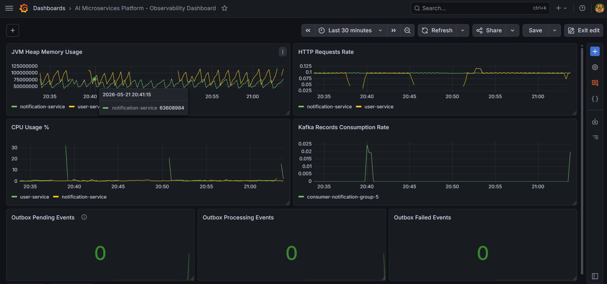
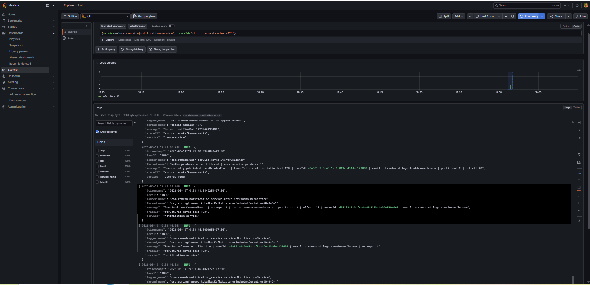

# AI-Driven Microservices Platform


An event-driven, cloud-native microservices platform designed to simulate real-world distributed systems using modern backend technologies.

This project demonstrates how independent services communicate asynchronously using Kafka, ensuring scalability, resilience, and loose coupling — similar to production-grade enterprise systems.

---

## 🎯 Project Goal

To design and implement a **real-world microservices ecosystem** that:

- Eliminates tight coupling between services
- Handles failures gracefully using retry & DLQ patterns
- Ensures data correctness under retries and duplicate events
- Processes events asynchronously at scale
- Demonstrates production-ready architecture patterns
- Can be deployed to AWS using containerized infrastructure

---

## 🧩 Core Use Case

A simplified distributed workflow:

1. **User Service**
   - Creates users
   - Persists data in MySQL
   - Publishes `UserCreatedEvent` to Kafka

2. **Notification Service**
   - Consumes events from Kafka
   - Applies idempotency checks
   - Sends notifications (currently simulated/logged)

3. **Future Extensions**
   - Payment Service
   - Analytics Service
   - AI Processing Service

---

## 🏗 Architecture Overview

- Event-driven communication using Kafka
- Schema-based messaging using Avro + Schema Registry
- Independent deployable microservices
- Centralized contract management via `common-schema`
- Heterogeneous persistence strategy (MySQL + PostgreSQL)
- Containerized using Docker

> See architecture diagram below 👇


---
## 📝 Articles

- [Idempotency in Distributed Systems: From Concept to Kafka Implementation](https://medium.com/@yara.ramesh/idempotency-in-distributed-systems-from-concept-to-kafka-implementation-68d453a05733)

---

## ⚙️ Key Architectural Principles

### 🔹 Loose Coupling
Services communicate via events instead of direct REST calls.

### 🔹 Resilience by Design
- Retry mechanisms
- Dead Letter Topics (DLT)
- Fault isolation between services

### 🔹 Data Integrity & Idempotency
- Ensures correctness under retries and duplicate message delivery
- Implements idempotent consumer pattern
- Prevents duplicate side effects (e.g., multiple notifications)

### 🔹 Scalability
Kafka enables horizontal scaling of consumers and producers.

### 🔹 Schema Evolution
Avro + Schema Registry ensures backward/forward compatibility.

### 🔹 Traceability
Correlation IDs are propagated across HTTP requests and Kafka events for end-to-end distributed request tracing.

---

## 📦 Project Structure

```
ai-microservices-platform/
│
├── user-service/              # Publishes user events (MySQL)
├── notification-service/     # Consumes and processes events (PostgreSQL)
├── common-schema/            # Shared Avro schemas (event contracts)
├── docker/                   # Kafka + Schema Registry setup
├── docs/                     # Architecture diagrams
```

---

## 🔄 Event Flow

```
User API Request
      ↓
User Service (MySQL)
      ↓ (Publish Event)
Kafka Topic
      ↓ (Consume Event)
Notification Service (PostgreSQL)
      ↓
Idempotency Check → Process → Log Notification
```

---

## 🛠 Tech Stack

### Backend
- Java 21
- Spring Boot 4+
- Spring Kafka
- MapStruct
- Lombok

### Messaging
- Apache Kafka (KRaft mode)
- Confluent Schema Registry
- Avro

### Data
- MySQL (User Service)
- PostgreSQL (Notification Service)
- Flyway (Notification Service migrations)
- Liquibase (User Service migrations)

### DevOps & Infrastructure
- Docker
- Kubernetes (EKS - planned)
- Terraform (planned)
- GitHub Actions (CI)

### Observability
- Spring Boot Actuator
- Micrometer
- Prometheus
- Grafana
- JVM metrics monitoring
- HTTP request rate monitoring
- Kafka consumer throughput monitoring
- CPU utilization tracking

---

## 🛡 Failure Handling Strategy

- Implemented retry using Spring Kafka `@RetryableTopic`
- Configured Dead Letter Topic (DLT) for failed events
- Added custom DLT handler for failure processing
- Ensures system resilience and fault isolation

---

## 🧩 Idempotent Consumer Strategy

- Implemented processed event tracking in Notification Service
- Uses unique `eventId` to detect duplicate events
- Stores processed events in PostgreSQL for persistence
- Applies application-level and database-level safeguards
- Prevents duplicate notifications under retry or re-delivery scenarios

---

## 📊 Observability Setup

The platform includes a local observability stack for monitoring distributed event-driven workflows and Kafka-based asynchronous communication.

### Observability Stack

- Spring Boot Actuator
- Micrometer
- Prometheus
- Grafana 
- Loki
- Promtail

### Metrics Flow

```text
Spring Boot Services
        ↓
Actuator + Structured JSON Logs
        ↓
Prometheus Metrics Scraping + Promtail Log Shipping
        ↓
Prometheus + Loki
        ↓
Grafana Dashboards & Explore
```

### Dashboard Snapshot



### Monitored Metrics

- JVM Heap Memory Usage
- HTTP Request Rate
- CPU Utilization
- Kafka Consumer Throughput

### Logging

- Structured JSON logging using Logback
- MDC-based traceId enrichment
- Service-level contextual logging
- Correlation ID propagation across Kafka events
- Logs prepared for centralized aggregation with Loki/ELK

### Centralized Logging

The platform supports centralized log aggregation using Loki and Promtail for distributed debugging and cross-service traceability.

### Logging Flow

```text
Spring Boot Services
        ↓
Structured JSON Logs
        ↓
Promtail
        ↓
Loki
        ↓
Grafana Explore
```

### Features

- Centralized log aggregation
- Distributed traceId search across services
- Kafka workflow traceability
- Grafana Explore integration
- Structured JSON log ingestion

### Available Endpoints

```text
http://localhost:8080/actuator/prometheus
http://localhost:8081/actuator/prometheus
http://localhost:9090
http://localhost:3000
http://localhost:3100
http://localhost:9080
```

---

## 🔍 Distributed Request Tracing

The platform supports end-to-end request traceability across synchronous HTTP requests and asynchronous Kafka event flows using correlation IDs and MDC-based logging.

### Tracing Flow

```text
Incoming HTTP Request
        ↓
Correlation ID Filter
        ↓
User Service Logs
        ↓
Kafka Event Headers
        ↓
Notification Service Consumer
        ↓
Notification Processing Logs
```

### Features

- Correlation ID generation using `X-Correlation-Id`
- MDC-based contextual logging
- Kafka header trace propagation
- End-to-end trace visibility across services
- Thread-safe MDC cleanup for Kafka consumers

### Example Trace

```text
[user-service,traceId:trace-kafka-123]
[notification-service,traceId:trace-kafka-123]
```

---

## 🚀 Running Locally

### 1. Start Infrastructure
```bash
docker-compose up -d
```

### 2. Start Services
```bash
cd user-service && ./gradlew bootRun
cd notification-service && ./gradlew bootRun
```

---

## 📌 Current Status

- ✅ Event publishing (User Service)
- ✅ Event consumption (Notification Service)
- ✅ Avro schema integration
- ✅ Dockerized Kafka (KRaft mode)
- ✅ Retry mechanism using `@RetryableTopic`
- ✅ Dead Letter Topic (DLT) handling with `@DltHandler`
- ✅ Idempotent consumer with processed event tracking
- ✅ Spring Boot Actuator enabled
- ✅ Prometheus metrics endpoint exposed
- ✅ Grafana observability dashboard implemented
- ✅ Distributed request tracing with correlation IDs
- ✅ Centralized logging with Loki and Promtail
- ✅ Structured JSON logging with traceId enrichment

---

## 🧠 Key Learnings

- Synchronous calls don’t scale in distributed systems
- Event-driven architecture improves decoupling
- Kafka provides at-least-once delivery — consumers must be idempotent
- Failure handling is critical (Retry, DLQ, Idempotency)
- Database constraints are essential for protecting against race conditions
- Schema evolution is essential in microservices

---

## 📈 Future Enhancements

- Add API Gateway
- Introduce authentication (JWT)
- Deploy to AWS EKS
- Replace mock notifications with real email provider (AWS SES / SendGrid)
- Enhance centralized logging with advanced Loki pipelines
- Add distributed tracing (OpenTelemetry)

---

### Example Log Queries

```logql
{traceId="structured-kafka-test-123"}
```

```logql
{service=~"user-service|notification-service", traceId="structured-kafka-test-123"}
```

These queries enable cross-service distributed request tracing through Kafka workflows using centralized log aggregation.

## 🤝 Contributing

This project is built as part of a hands-on learning journey into distributed systems and microservices.

Feel free to explore, fork, and improve!
