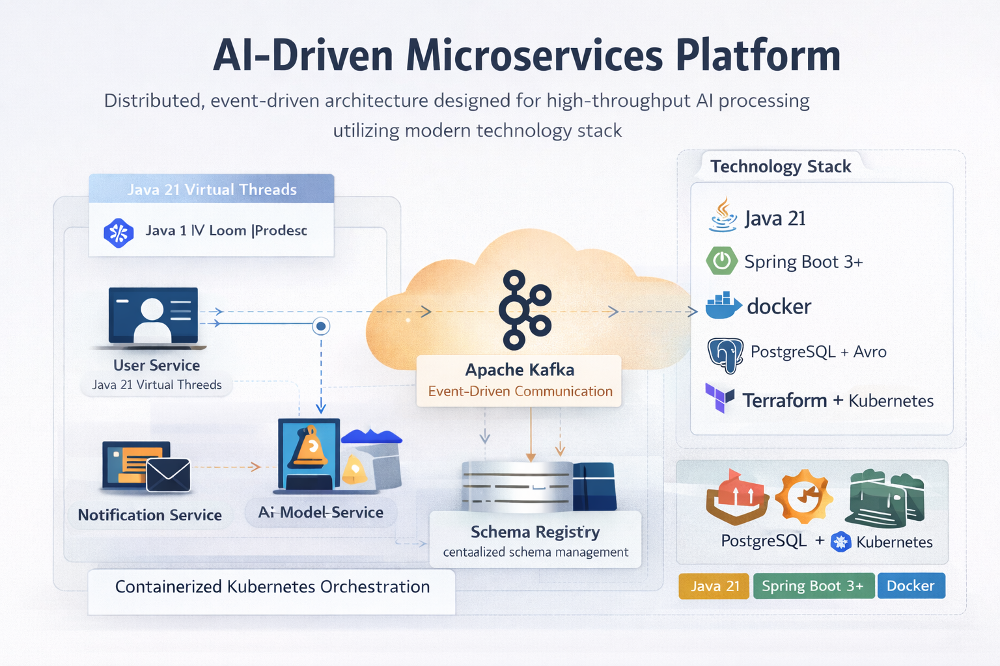

# AI-Driven Microservices Platform


An event-driven, cloud-native microservices platform designed to simulate real-world distributed systems using modern backend technologies.

This project demonstrates how independent services communicate asynchronously using Kafka, ensuring scalability, resilience, and loose coupling — similar to production-grade enterprise systems.

---

## 🎯 Project Goal

To design and implement a **real-world microservices ecosystem** that:

- Eliminates tight coupling between services
- Handles failures gracefully using retry & DLQ patterns
- Processes events asynchronously at scale
- Demonstrates production-ready architecture patterns
- Can be deployed to AWS using containerized infrastructure

---

## 🧩 Core Use Case

A simplified distributed workflow:

1. **User Service**
    - Creates users
    - Publishes `UserCreatedEvent` to Kafka

2. **Notification Service**
    - Consumes events from Kafka
    - Sends notifications (simulated/logged)

3. **Future Extensions**
    - Payment Service
    - Analytics Service
    - AI Processing Service

---

## 🏗 Architecture Overview

- Event-driven communication using Kafka
- Schema-based messaging using Avro + Schema Registry
- Independent deployable microservices
- Centralized contract management via `common-schema`
- Containerized using Docker

> See architecture diagram below 👇



---

## ⚙️ Key Architectural Principles

### 🔹 Loose Coupling
Services communicate via events instead of direct REST calls.

### 🔹 Resilience by Design
- Retry mechanisms
- Dead Letter Topics (DLT)
- Fault isolation between services

### 🔹 Scalability
Kafka enables horizontal scaling of consumers and producers.

### 🔹 Schema Evolution
Avro + Schema Registry ensures backward/forward compatibility.

---

## 📦 Project Structure

```
ai-microservices-platform/
│
├── user-service/              # Publishes user events
├── notification-service/     # Consumes and processes events
├── common-schema/            # Shared Avro schemas (event contracts)
├── docker/                   # Kafka + Schema Registry setup
├── docs/                     # Architecture diagrams
```

---

## 🔄 Event Flow

```
User API Request
      ↓
User Service
      ↓ (Publish Event)
Kafka Topic
      ↓ (Consume Event)
Notification Service
      ↓
Process / Log Notification
```

---

## 🛠 Tech Stack

### Backend
- Java 21
- Spring Boot 3.4+
- Spring Kafka
- MapStruct
- Lombok

### Messaging
- Apache Kafka (KRaft mode)
- Confluent Schema Registry
- Avro

### Data
- PostgreSQL (Production)
- H2 (Development)

### DevOps & Infrastructure
- Docker
- Kubernetes (EKS - planned)
- Terraform (planned)
- GitHub Actions (CI)

### Observability (Planned)
- Spring Boot Actuator
- Prometheus
- Grafana

---

## 🚀 Running Locally

### 1. Start Infrastructure
```bash
docker-compose up -d
```

### 2. Start Services
```bash
cd user-service && ./gradlew bootRun
cd notification-service && ./gradlew bootRun
```

---

## 📌 Current Status

- ✅ Event publishing (User Service)
- ✅ Event consumption (Notification Service)
- ✅ Avro schema integration
- ✅ Dockerized Kafka (KRaft mode)
- 🚧 Retry & DLQ (in progress)
- 🚧 Idempotent consumer (in progress)
- 🚧 Observability setup (planned)

---

## 🧠 Key Learnings

- Synchronous calls don’t scale in distributed systems
- Event-driven architecture improves decoupling
- Failure handling is critical (Retry, DLQ, Idempotency)
- Schema evolution is essential in microservices

---

## 📈 Future Enhancements

- Add API Gateway
- Introduce authentication (JWT)
- Deploy to AWS EKS
- Add centralized logging (ELK)
- Add distributed tracing (OpenTelemetry)

---

## 🤝 Contributing

This project is built as part of a hands-on learning journey into distributed systems and microservices.

Feel free to explore, fork, and improve!
