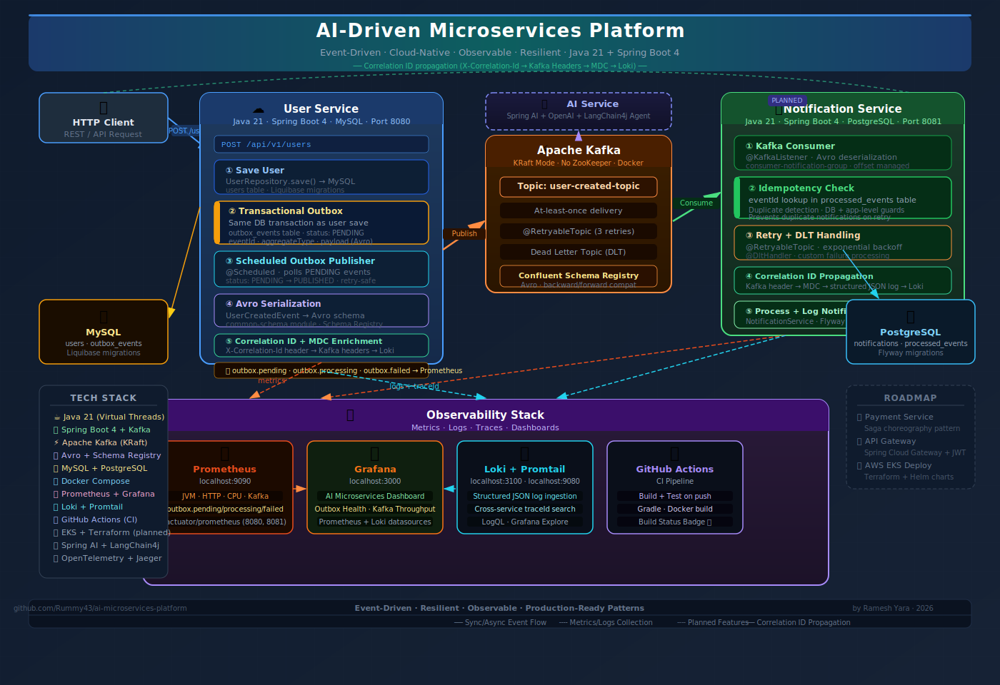
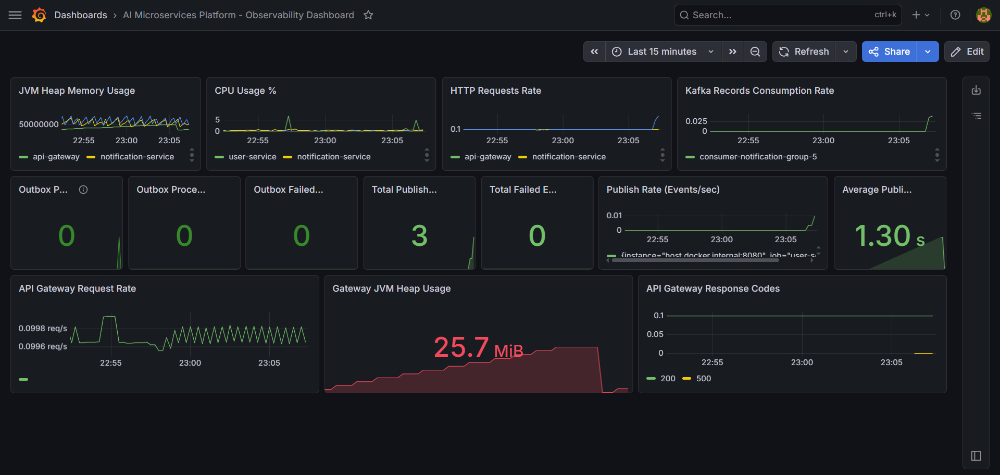

# AI-Driven Microservices Platform


An event-driven, cloud-native microservices platform designed to simulate real-world distributed systems using modern backend technologies.

This project demonstrates how independent services communicate asynchronously using Kafka, ensuring scalability, resilience, and loose coupling — similar to production-grade enterprise systems.

---

## 🎯 Project Goal

To design and implement a **real-world microservices ecosystem** that:

- Eliminates tight coupling between services
- Handles failures gracefully using retry & DLQ patterns
- Ensures data correctness under retries and duplicate events
- Processes events asynchronously at scale
- Demonstrates production-ready architecture patterns
- Can be deployed to AWS using containerized infrastructure

---

## 🧩 Core Use Case

A simplified distributed workflow:

1. **User Service**
   - Creates users
   - Persists data in MySQL
   - Stores `UserCreatedEvent` in an outbox table within the same database transaction
   - Publishes pending outbox events to Kafka through a scheduled publisher

2. **Notification Service**
   - Consumes events from Kafka
   - Applies idempotency checks
   - Sends notifications (currently simulated/logged)

3. **Future Extensions**
   - Payment Service
   - Analytics Service
   - AI Processing Service

---

## 🏗 Architecture Overview

- Event-driven communication using Kafka
- Schema-based messaging using Avro + Schema Registry
- API Gateway as a centralized entry point
- Independent deployable microservices
- Centralized contract management via `common-schema`
- Heterogeneous persistence strategy (MySQL + PostgreSQL)
- Containerized using Docker
- Reliable event delivery using Transactional Outbox Pattern

> See architecture diagram below 👇



---
## API Gateway

Spring Cloud Gateway provides a centralized entry point into the platform.

### Responsibilities

- Request routing
- Correlation ID propagation
- Centralized observability
- Future JWT authentication
- Future rate limiting
- JWT authentication using Keycloak
- OAuth2 Resource Server
- Centralized authentication enforcement

### Current Routes

| Route | Target Service |
|---------|---------|
| /api/v1/users/** | user-service |
| /api/v1/notifications/** | notification-service |
---

## 🔐 Authentication & Authorization

The platform uses Keycloak as the Identity and Access Management (IAM) provider.

### Features

- OAuth2 Resource Server
- JWT-based authentication
- Role-Based Access Control (RBAC)
- Centralized authentication at API Gateway
- Realm role extraction from Keycloak tokens
- Secure service access through Gateway

### Implemented Roles

| Role | Permissions |
|--------|--------|
| USER | Access user-facing APIs |
| ADMIN | Access user APIs and administrative APIs |

### Security Flow

```text
Client
   ↓
Keycloak Authentication
   ↓
JWT Access Token
   ↓
API Gateway
   ↓
JWT Validation
   ↓
Role Extraction
   ↓
RBAC Authorization
   ↓
Target Microservice
```

---

## 📝 Articles
| # | Article | Topics |
|---|---------|--------|
| 1 | [From Synchronous Calls to Event-Driven Microservices: Practical Lessons from Real Implementation](https://medium.com/@yara.ramesh/from-synchronous-calls-to-event-driven-microservices-practical-lessons-from-real-implementation-8e84c638e300) | Event-driven architecture, Kafka, Spring Boot, decoupling |
| 2 | [Idempotency in Distributed Systems: From Concept to Kafka Implementation](https://medium.com/@yara.ramesh/idempotency-in-distributed-systems-from-concept-to-kafka-implementation-68d453a05733) | Idempotency, @RetryableTopic, @DltHandler, duplicate prevention |
| 3 | [Observability in Event-Driven Microservices: Metrics, Dashboards, and Traceability](https://medium.com/@yara.ramesh/observability-in-event-driven-microservices-metrics-dashboards-and-traceability-774678de1e2c) | Prometheus, Grafana, Loki, Promtail, structured logging |
| 4 | [Why Database Transactions and Kafka Publishing Are Not Atomic](https://medium.com/@yara.ramesh/why-database-transactions-and-kafka-publishing-are-not-atomic-45923c390dd8) | Transactional Outbox Pattern, reliable event delivery, Micrometer |

---

## ⚙️ Key Architectural Principles

### 🔹 Loose Coupling
Services communicate via events instead of direct REST calls.

### 🔹 Resilience by Design
- Retry mechanisms
- Dead Letter Topics (DLT)
- Fault isolation between services

### 🔹 Data Integrity & Idempotency
- Ensures correctness under retries and duplicate message delivery
- Implements idempotent consumer pattern
- Prevents duplicate side effects (e.g., multiple notifications)

### 🔹 Scalability
Kafka enables independent horizontal scaling of producers and consumers.

### 🔹 Schema Evolution
Avro + Schema Registry ensures backward/forward compatibility.

### 🔹 Traceability
Correlation IDs are propagated across HTTP requests and Kafka events for end-to-end distributed request tracing.

### 🔹 Transactional Outbox
User creation and event persistence happen in the same database transaction. A scheduled outbox publisher later publishes pending events to Kafka, reducing the risk of losing events when database writes succeed but Kafka publishing fails.

---

## 📦 Project Structure

```
ai-microservices-platform/
│
├── api-gateway            # Spring Cloud Gateway
├── user-service           # Publishes user events (MySQL)
├── notification-service   # Consumes and processes events (PostgreSQL)
├── common-schema          # Shared Avro schemas
├── docker                 # Kafka + Schema Registry setup
├── docs                   # Architecture diagrams
```

---

## 🔄 Event Flow

```
Client Request
      ↓
API Gateway
      ↓
User Service (MySQL Transaction)
      ├── Save User
      └── Save Outbox Event
      ↓
Outbox Publisher
      ↓
Kafka Topic
      ↓
Notification Service (PostgreSQL)
      ↓
Idempotency Check → Process → Log Notification
```

---

## 🛠 Tech Stack

### Backend
- Java 21
- Spring Boot 4+
- Spring Kafka
- MapStruct
- Lombok
- OpenAPI / Swagger

### API Gateway

- Spring Cloud Gateway MVC

### Messaging
- Apache Kafka (KRaft mode)
- Confluent Schema Registry
- Avro

### Data
- MySQL (User Service)
- PostgreSQL (Notification Service)
- Flyway (Notification Service migrations)
- Liquibase (User Service migrations)

### DevOps & Infrastructure
- Docker
- Kubernetes (EKS - planned)
- Terraform (planned)
- GitHub Actions (CI)

### Observability
- Spring Boot Actuator
- Micrometer
- Prometheus
- Grafana
- JVM metrics monitoring
- HTTP request rate monitoring
- Kafka consumer throughput monitoring
- CPU utilization tracking

---

## 🛡 Failure Handling Strategy

- Implemented retry using Spring Kafka `@RetryableTopic`
- Configured Dead Letter Topic (DLT) for failed events
- Added custom DLT handler for failure processing
- Ensures system resilience and fault isolation

---

## 🧩 Idempotent Consumer Strategy

- Implemented processed event tracking in Notification Service
- Uses unique `eventId` to detect duplicate events
- Stores processed events in PostgreSQL for persistence
- Applies application-level and database-level safeguards
- Prevents duplicate notifications under retry or re-delivery scenarios

---

## 📊 Observability Setup

The platform includes a local observability stack for monitoring distributed event-driven workflows and Kafka-based asynchronous communication.

### Observability Stack

- Spring Boot Actuator
- Micrometer
- Prometheus
- Grafana 
- Loki
- Promtail

### Metrics Flow

```text
Spring Boot Services
        ↓
Actuator + Structured JSON Logs
        ↓
Prometheus Metrics Scraping + Promtail Log Shipping
        ↓
Prometheus + Loki
        ↓
Grafana Dashboards & Explore
```

### Dashboard Snapshot

Grafana dashboard providing visibility into:

- JVM Heap Memory Usage
- CPU Utilization
- HTTP Request Rate
- Kafka Consumer Throughput
- Transactional Outbox Health
- Event Publishing Metrics
- Outbox Processing Performance



### Monitored Metrics

Infrastructure Metrics

- JVM Heap Memory Usage
- CPU Utilization
- HTTP Request Rate
- Kafka Consumer Throughput

Transactional Outbox Metrics

- Pending Outbox Events
- Processing Outbox Events
- Failed Outbox Events
- Total Published Events
- Publish Rate (events/sec)
- Average Publish Duration

### Structured Logging

- Structured JSON logging using Logback
- MDC-based traceId enrichment
- Service-level contextual logging
- Correlation ID propagation across Kafka events
- Logs prepared for centralized aggregation with Loki/ELK

### Centralized Logging

The platform supports centralized log aggregation using Loki and Promtail for distributed debugging and cross-service traceability.


### Logging Flow

```text
Spring Boot Services
        ↓
Structured JSON Logs
        ↓
Promtail
        ↓
Loki
        ↓
Grafana Explore
```

### Features

- Centralized log aggregation
- Distributed traceId search across services
- Kafka workflow traceability
- Grafana Explore integration
- Structured JSON log ingestion

### Available Endpoints

```text
User Service:
http://localhost:8080/swagger-ui.html

Notification Service:
http://localhost:8081/swagger-ui.html

API Gateway:
http://localhost:8082/api/v1/users/**
http://localhost:8082/api/v1/notifications/**
http://localhost:8082/actuator/prometheus

Prometheus:
http://localhost:9090

Grafana:
http://localhost:3000

Loki:
http://localhost:3100

Promtail:
http://localhost:9080
```

---

## 🔍 Distributed Request Tracing

The platform supports end-to-end request traceability across synchronous HTTP requests and asynchronous Kafka event flows using correlation IDs and MDC-based logging.

### Tracing Flow

```text
Incoming HTTP Request
        ↓
API Gateway
        ↓
Gateway Correlation Filter
        ↓
User Service Logs
        ↓
Kafka Event Headers
        ↓
Notification Service Consumer
        ↓
Notification Processing Logs
```

### Features

- Correlation ID generation using `X-Correlation-Id`
- MDC-based contextual logging
- Kafka header trace propagation
- End-to-end trace visibility across services
- Thread-safe MDC cleanup for Kafka consumers

### Example Trace

```text
[user-service,traceId:trace-kafka-123]
[notification-service,traceId:trace-kafka-123]
```

---

## 🚀 Running Locally

### 1. Start Infrastructure
```bash
docker-compose up -d
```

### 2. Start Services
```bash
cd api-gateway && ./gradlew bootRun
cd user-service && ./gradlew bootRun
cd notification-service && ./gradlew bootRun
```

---

## 📌 Current Status

- ✅ Event publishing (User Service)
- ✅ Event consumption (Notification Service)
- ✅ Avro schema integration
- ✅ Dockerized Kafka (KRaft mode)
- ✅ Retry mechanism using `@RetryableTopic`
- ✅ Dead Letter Topic (DLT) handling with `@DltHandler`
- ✅ Idempotent consumer with processed event tracking
- ✅ Spring Boot Actuator enabled
- ✅ Prometheus metrics endpoint exposed
- ✅ Grafana observability dashboard implemented
- ✅ Distributed request tracing with correlation IDs
- ✅ Centralized logging with Loki and Promtail
- ✅ Structured JSON logging with traceId enrichment
- ✅ Transactional outbox pattern for reliable Kafka publishing
- ✅ Scheduled outbox publisher with retry-safe status handling
- ✅ Custom Micrometer metrics for transactional outbox monitoring
- ✅ Grafana operational dashboard for outbox publishing visibility
- ✅ Outbox publish rate and latency monitoring
- ✅ Spring Cloud API Gateway 
- ✅ Gateway-based routing 
- ✅ Correlation ID propagation through Gateway 
- ✅ Gateway Prometheus metrics 
- ✅ Gateway Grafana monitoring
- ✅ Centralized entry point for services
- ✅ Keycloak integration
- ✅ JWT authentication at API Gateway
- ✅ OAuth2 Resource Server configuration
- ✅ Protected API routes
- ✅ Role-Based Access Control (RBAC)
- ✅ Keycloak realm-role mapping

---

## 🧠 Key Learnings

- Synchronous calls don’t scale in distributed systems
- Event-driven architecture improves decoupling
- Kafka provides at-least-once delivery — consumers must be idempotent
- Failure handling is critical (Retry, DLQ, Idempotency)
- Database constraints are essential for protecting against race conditions
- Schema evolution is essential in microservices

---

## 📈 Future Enhancements

- Service Discovery (Eureka)
- Fine-grained permission-based authorization
- Identity propagation across microservices
- Rate Limiting
- AWS EKS Deployment
- OpenTelemetry Distributed Tracing
- Replace mock notifications with real email provider (AWS SES / SendGrid)
- Enhance centralized logging with advanced Loki pipelines
- Upgrade correlation-ID tracing to OpenTelemetry distributed tracing

---

### Example Log Queries

```logql
{traceId="structured-kafka-test-123"}
```

```logql
{service=~"user-service|notification-service", traceId="structured-kafka-test-123"}
```

These queries enable cross-service distributed request tracing through Kafka workflows using centralized log aggregation.

## 🤝 Contributing

This project demonstrates modern distributed systems architecture and operational engineering patterns using event-driven microservices.

Feel free to explore, fork, and improve!
