# AI-Driven Microservices Platform


A production-grade, event-driven, cloud-native microservices platform built on Java 21, Spring Boot 4, and Kafka — demonstrating how real enterprise distributed systems are architected, observed, and operated.

The platform covers the full engineering lifecycle: asynchronous event-driven communication, distributed tracing, structured alerting with SLOs, containerization, Kubernetes deployment with in-cluster observability, and an AI enrichment pipeline powered by a local LLM.

---

## 🎯 Project Goal

To design and implement a **production-grade microservices ecosystem** that:

- Eliminates tight coupling between services via async event-driven communication
- Handles failures gracefully: retry topics, Dead Letter Topics, transactional outbox, circuit breakers
- Ensures data correctness under retries and duplicate events (idempotent consumer, DB unique constraints)
- Monitors health with real SLIs/SLOs, multi-window burn-rate alerts, and live-fire–verified alert paths
- Runs in Kubernetes with full in-cluster observability (Prometheus, Grafana, Tempo, Loki, Alertmanager)
- Enriches events with AI using a local LLM (Ollama + Spring AI) in a non-fatal pipeline
- Is deployable to AWS EKS via Terraform (Phase 10, roadmap)

---

## 🧩 Core Use Case

A simplified distributed workflow:

1. **User Service**
   - Creates users
   - Persists data in MySQL
   - Stores `UserCreatedEvent` in an outbox table within the same database transaction
   - Publishes pending outbox events to Kafka through a scheduled publisher

2. **Notification Service**
   - Consumes `UserCreatedEvent` from Kafka
   - Applies idempotency checks (processed-event tracking + DB unique constraint)
   - Calls ai-service for an AI-enriched personalized welcome message (non-fatal: falls back to a static message if unavailable)
   - Persists notification log with actor audit context

3. **AI Service**
   - Receives enrichment requests from notification-service
   - Calls a local Ollama LLM (llama3.2) via Spring AI to generate personalized notification content
   - Backed by PGVector for future semantic search / RAG capabilities
   - Designed to be stateless and non-blocking: callers never fail if this service is down

---

## 🏗 Architecture Overview

- Event-driven communication using Kafka (KRaft mode)
- Schema-based messaging using Avro + Confluent Schema Registry
- API Gateway as the security perimeter (Keycloak OAuth2/JWT, RBAC, rate limiting, circuit breakers)
- Independent deployable microservices with independent Gradle builds
- Centralized contract management via `common-schema` Maven artifact
- Heterogeneous persistence strategy (MySQL + PostgreSQL + PGVector)
- Containerized services with layered Docker images (non-root, OTel agent baked in)
- Deployed to Kubernetes via Kustomize manifests (kind cluster, production-ready manifest patterns)
- Reliable event delivery via Transactional Outbox Pattern (PENDING → PROCESSING → PUBLISHED)
- End-to-end identity propagation and audit context (Gateway → services → Kafka → dead-letter)
- Full SLO-based alerting stack: SLIs per service, multi-window burn rates, Alertmanager, runbooks — all live-fire verified
- In-cluster observability: kube-prometheus-stack + Tempo + Loki + Promtail + kafka-exporter
- AI enrichment pipeline: local LLM (Ollama + Spring AI) called non-fatally from the Kafka consumer

> See architecture diagram below 👇

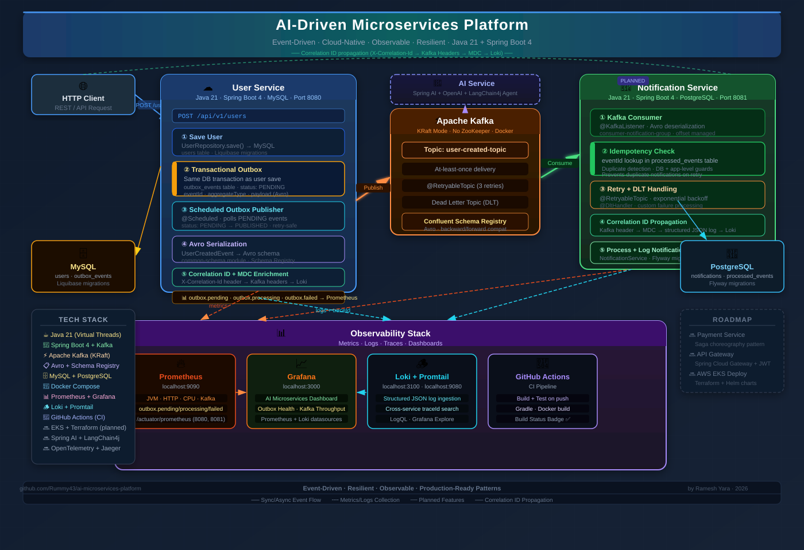

---
## API Gateway

Spring Cloud Gateway provides a centralized entry point into the platform.

### Responsibilities

- Request routing
- Correlation ID propagation
- Centralized observability
- Future JWT authentication
- Future rate limiting
- JWT authentication using Keycloak
- OAuth2 Resource Server
- Centralized authentication enforcement
- Identity propagation to downstream services (trusted `X-User-*` headers)

### Current Routes

| Route | Target Service |
|---------|---------|
| /api/v1/users/** | user-service |
| /api/v1/notifications/** | notification-service |
---

## 🔐 Authentication & Authorization

The platform uses Keycloak as the Identity and Access Management (IAM) provider.

### Features

- OAuth2 Resource Server
- JWT-based authentication
- Role-Based Access Control (RBAC)
- Centralized authentication at API Gateway
- Realm role extraction from Keycloak tokens
- Secure service access through Gateway

### Implemented Roles

| Role | Permissions |
|--------|--------|
| USER | Access user-facing APIs |
| ADMIN | Access user APIs and administrative APIs |

### Security Flow

```text
Client
   ↓
Keycloak Authentication
   ↓
JWT Access Token
   ↓
API Gateway
   ↓
JWT Validation
   ↓
Role Extraction
   ↓
RBAC Authorization
   ↓
Target Microservice
```

---

## 🪪 Identity Propagation & Audit Context

While the API Gateway authenticates the caller and enforces RBAC, downstream services historically had no knowledge of *who* triggered a request. The platform now propagates the authenticated identity end-to-end — across synchronous HTTP hops and asynchronous Kafka event flows — so every service, event, and persisted record retains the originating actor for auditing and traceability.

### How It Works

1. **Gateway** — after JWT validation, an `IdentityPropagationFilter` extracts the identity from the already-verified token (`preferred_username`, `email`, realm roles) and injects it as trusted headers (`X-User-Name`, `X-User-Email`, `X-User-Roles`). These headers are **always overwritten**, so a client cannot spoof its own identity.
2. **User Service** — an inbound filter rebuilds the identity into a thread-bound `IdentityContextHolder` and MDC. When a user is created, the actor and `traceId` are captured on the request thread and persisted **inside the same transaction** on the outbox row.
3. **Outbox Publisher** — the scheduled publisher reads the actor/trace context from the persisted outbox row (not from ThreadLocal, which is absent on the scheduler thread) and emits it as Kafka headers alongside the event.
4. **Notification Service** — the Kafka consumer rehydrates the actor from the inbound headers, re-binds it to the consumer thread + MDC, and persists it onto every `notification_log` and `dead_letter_event` record.

### Propagation Contract

| Transport | Identity Carrier |
|-----------|------------------|
| HTTP (Gateway → services) | `X-User-Name`, `X-User-Email`, `X-User-Roles` headers |
| Persistence (outbox) | `actor_username`, `actor_email`, `actor_roles`, `trace_id` columns |
| Kafka (user → notification) | `X-User-Name`, `X-User-Email`, `X-User-Roles`, `traceId` event headers |
| Audit records | `actor_*` columns on `notification_log` and `dead_letter_events` |

### Propagation Flow

```text
Keycloak JWT
      ↓
API Gateway (IdentityPropagationFilter → identity headers)
      ↓
User Service (IdentityContextHolder + MDC)
      ↓
Outbox Event (actor + traceId persisted in same transaction)
      ↓
Kafka Headers (actor + traceId)
      ↓
Notification Service (identity rehydrated onto consumer thread + MDC)
      ↓
notification_log / dead_letter_events (actor persisted)
```

### Features

- Trusted, spoof-resistant identity headers minted at the gateway
- Transport-agnostic `IdentityContext` reused across HTTP and Kafka
- Thread-bound `IdentityContextHolder` with strict `finally` cleanup (virtual-thread safe)
- Actor context captured transactionally with the outbox event
- Actor identity carried through Kafka headers, surviving retries and DLQ
- Durable audit trail: who triggered each notification and each dead-lettered event
- MDC enrichment so structured logs carry `username`, `email`, and `roles`

---

## 📝 Articles
| # | Article | Topics |
|---|---------|--------|
| 1 | [From Synchronous Calls to Event-Driven Microservices: Practical Lessons from Real Implementation](https://medium.com/@yara.ramesh/from-synchronous-calls-to-event-driven-microservices-practical-lessons-from-real-implementation-8e84c638e300) | Event-driven architecture, Kafka, Spring Boot, decoupling |
| 2 | [Idempotency in Distributed Systems: From Concept to Kafka Implementation](https://medium.com/@yara.ramesh/idempotency-in-distributed-systems-from-concept-to-kafka-implementation-68d453a05733) | Idempotency, @RetryableTopic, @DltHandler, duplicate prevention |
| 3 | [Observability in Event-Driven Microservices: Metrics, Dashboards, and Traceability](https://medium.com/@yara.ramesh/observability-in-event-driven-microservices-metrics-dashboards-and-traceability-774678de1e2c) | Prometheus, Grafana, Loki, Promtail, structured logging |
| 4 | [Why Database Transactions and Kafka Publishing Are Not Atomic](https://medium.com/@yara.ramesh/why-database-transactions-and-kafka-publishing-are-not-atomic-45923c390dd8) | Transactional Outbox Pattern, reliable event delivery, Micrometer |
| 5 | [Your Service Map Is Lying: Verifying OpenTelemetry Auto-Instrumentation](https://medium.com/@yara.ramesh/your-service-map-is-lying-cfc84fb38990) | OpenTelemetry, service graph, Kafka spans, verify-don't-assume |
| 6 | [Who Did This? Identity Across Async Boundaries](https://medium.com/@yara.ramesh/who-did-this-identity-across-async-boundaries-823c712b073f) | Identity propagation, audit context, Kafka headers, dead-letter attribution |
| 7 | [The Outbox Pattern Is Not Enough](https://medium.com/@yara.ramesh/the-outbox-pattern-is-not-enough-07c4fe231296) | Outbox failure modes, terminal FAILED rows, alerting blind spots, SLO design |

---

## ⚙️ Key Architectural Principles

### 🔹 Loose Coupling
Services communicate via events instead of direct REST calls.

### 🔹 Resilience by Design
- Retry mechanisms
- Dead Letter Topics (DLT)
- Fault isolation between services

### 🔹 Data Integrity & Idempotency
- Ensures correctness under retries and duplicate message delivery
- Implements idempotent consumer pattern
- Prevents duplicate side effects (e.g., multiple notifications)

### 🔹 Scalability
Kafka enables independent horizontal scaling of producers and consumers.

### 🔹 Schema Evolution
Avro + Schema Registry ensures backward/forward compatibility.

### 🔹 Traceability
Correlation IDs are propagated across HTTP requests and Kafka events for end-to-end distributed request tracing.

### 🔹 Transactional Outbox
User creation and event persistence happen in the same database transaction. A scheduled outbox publisher later publishes pending events to Kafka, reducing the risk of losing events when database writes succeed but Kafka publishing fails.

---

## 📦 Project Structure

```
ai-microservices-platform/
│
├── api-gateway/           # Spring Cloud Gateway — JWT validation, RBAC, circuit breakers, rate limiting
├── user-service/          # UserCreatedEvent publisher — MySQL, Liquibase, Transactional Outbox
├── notification-service/  # Event consumer — PostgreSQL, Flyway, idempotent processing, AI enrichment call
├── ai-service/            # Spring AI 2.0 — Ollama LLM, PGVector, enrichment REST endpoint
├── common-schema/         # Shared Avro schemas (Maven artifact → ~/.m2)
├── docker/                # Docker Compose: full 15-container stack + all observability config
│   ├── grafana/           # Provisioned dashboards + datasources (code, not click-ops)
│   ├── prometheus/        # Scrape config + SLO recording/alert rules
│   ├── tempo/             # Tempo config (metrics-generator, remote-write)
│   └── promtail/          # Log shipping config
├── k8s/                   # Kubernetes manifests
│   ├── base/              # Kustomize base — all services, infra, observability
│   └── helm/              # Helm values for kube-prometheus-stack, Tempo, Loki, Promtail
└── docs/                  # Architecture diagrams, dashboard screenshots, SLO catalog, runbooks
```

---

## 🔄 Event Flow

```
Client Request
      ↓
API Gateway (JWT validation → rate limiting → circuit breaker → identity headers)
      ↓
User Service (MySQL Transaction)
      ├── Save User
      └── Save Outbox Event (+ actor & traceId, same transaction)
      ↓
Outbox Publisher (scheduled, PENDING → PROCESSING → PUBLISHED)
      ↓
Kafka Topic: user-created-events (Avro, Schema Registry validated)
      ↓
Notification Service (PostgreSQL)
      ├── Idempotency Check (processed_events table)
      ├── AI Enrichment Call → ai-service POST /api/v1/ai/enrich
      │     ├── [Ollama available] → llama3.2 generates personalized message
      │     └── [Ollama unavailable] → fallback: static welcome message (non-fatal)
      └── Persist notification_log (+ actor + enriched message)
```

---

## 🛠 Tech Stack

### Backend
- Java 21
- Spring Boot 4+
- Spring Kafka
- MapStruct
- Lombok
- OpenAPI / Swagger

### API Gateway

- Spring Cloud Gateway MVC

### Messaging
- Apache Kafka (KRaft mode)
- Confluent Schema Registry
- Avro

### Data
- MySQL (User Service)
- PostgreSQL (Notification Service)
- PGVector / `pgvector/pgvector:pg17` (AI Service — vector store)
- Flyway (Notification Service + AI Service migrations)
- Liquibase (User Service migrations)

### AI
- Spring AI 2.0 (`spring-ai-starter-model-ollama`, `spring-ai-starter-vector-store-pgvector`)
- Ollama (local LLM runtime — llama3.2 chat, nomic-embed-text embeddings)

### DevOps & Infrastructure
- Docker + Docker Compose (full 15-container stack)
- Kubernetes (kind cluster, Kustomize base/overlays — `k8s/base/`)
- Helm (kube-prometheus-stack, Tempo, Loki, Promtail)
- Terraform + AWS EKS (Phase 10, roadmap)
- GitHub Actions (CI)

### Observability
- Spring Boot Actuator + Micrometer → Prometheus
- Grafana (provisioned dashboards: JVM, HTTP, Kafka, Database, Business, Resilience, SLO overview)
- OpenTelemetry Java Agent 2.28.1 (zero-code: HTTP, JDBC, Kafka spans)
- Grafana Tempo (distributed tracing + service-graph metrics-generator)
- Grafana Loki + Promtail (structured JSON logs, bidirectional Tempo↔Loki correlation)
- kube-prometheus-stack (Prometheus Operator, in-cluster scraping via ServiceMonitor CRDs)
- Alertmanager (SLO burn-rate alerts, pipeline-stall detection, runbooks)
- kafka-exporter (broker-side consumer lag — closes the NaN-metric blind spot)

---

## 🛡 Failure Handling Strategy

- Implemented retry using Spring Kafka `@RetryableTopic`
- Configured Dead Letter Topic (DLT) for failed events
- Added custom DLT handler for failure processing
- Ensures system resilience and fault isolation

---

## 🧩 Idempotent Consumer Strategy

- Implemented processed event tracking in Notification Service
- Uses unique `eventId` to detect duplicate events
- Stores processed events in PostgreSQL for persistence
- Applies application-level and database-level safeguards
- Prevents duplicate notifications under retry or re-delivery scenarios

---

## 📊 Observability Setup

The platform includes a local observability stack for monitoring distributed event-driven workflows and Kafka-based asynchronous communication.

### Observability Stack

- Spring Boot Actuator
- Micrometer
- Prometheus
- Grafana 
- Loki
- Promtail
- OpenTelemetry Java Agent
- Grafana Tempo (traces + service-graph metrics)

### Metrics Flow

```text
Spring Boot Services
        ↓
Actuator + Structured JSON Logs
        ↓
Prometheus Metrics Scraping + Promtail Log Shipping
        ↓
Prometheus + Loki
        ↓
Grafana Dashboards & Explore
```

### Dashboard Snapshot

Grafana dashboard providing visibility into:

- JVM Heap Memory Usage
- CPU Utilization
- HTTP Request Rate
- Kafka Consumer Throughput
- Transactional Outbox Health
- Event Publishing Metrics
- Outbox Processing Performance

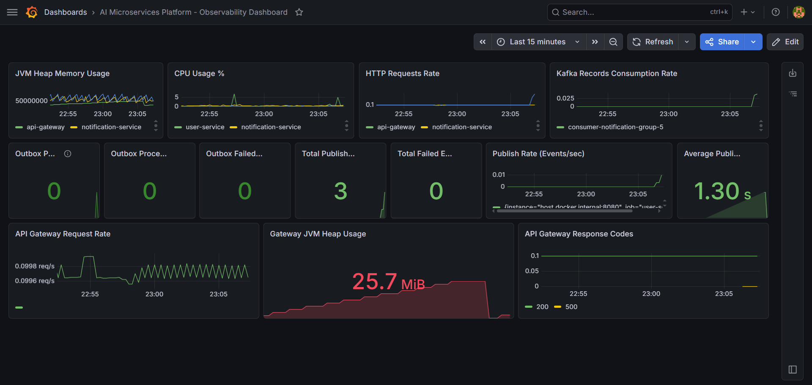

### Monitored Metrics

Infrastructure Metrics

- JVM Heap Memory Usage
- CPU Utilization
- HTTP Request Rate
- Kafka Consumer Throughput

Transactional Outbox Metrics

- Pending Outbox Events
- Processing Outbox Events
- Failed Outbox Events
- Total Published Events
- Publish Rate (events/sec)
- Average Publish Duration

### Structured Logging

- Structured JSON logging using Logback
- OpenTelemetry `traceId`/`spanId` enrichment via MDC (agent-injected, zero code changes)
- MDC enrichment with actor identity (`username`, `email`, `roles`)
- Service-level contextual logging
- Correlation ID propagation across Kafka events
- Logs prepared for centralized aggregation with Loki/ELK

### Centralized Logging

The platform supports centralized log aggregation using Loki and Promtail for distributed debugging and cross-service traceability.

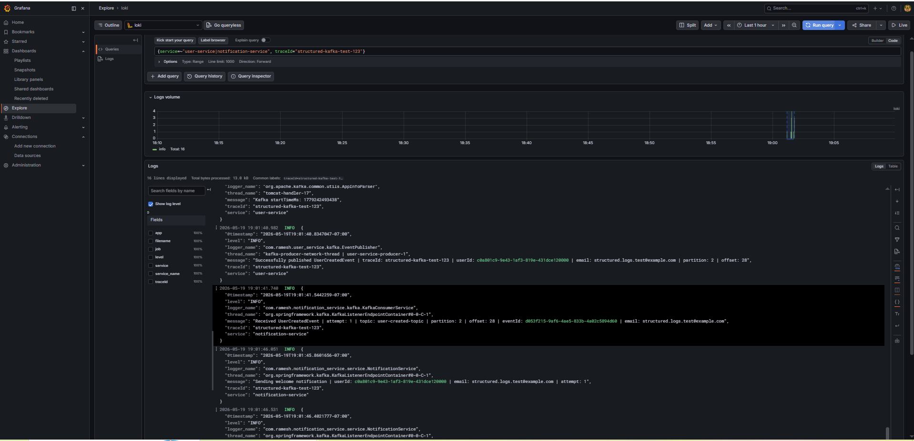
### Logging Flow

```text
Spring Boot Services
        ↓
Structured JSON Logs
        ↓
Promtail
        ↓
Loki
        ↓
Grafana Explore
```

### Features

- Centralized log aggregation
- Distributed traceId search across services
- Kafka workflow traceability
- Grafana Explore integration
- Structured JSON log ingestion

### Available Endpoints

```text
User Service:
http://localhost:8080/swagger-ui.html

Notification Service:
http://localhost:8081/swagger-ui.html

API Gateway:
http://localhost:8082/api/v1/users/**
http://localhost:8082/api/v1/notifications/**
http://localhost:8082/actuator/prometheus

Prometheus:
http://localhost:9090

Grafana:
http://localhost:3000

Loki:
http://localhost:3100

Promtail:
http://localhost:9080
```

---

## 🔍 Distributed Request Tracing

The platform supports end-to-end request traceability across synchronous HTTP requests and asynchronous Kafka event flows using correlation IDs and MDC-based logging.

### Tracing Flow

```text
Incoming HTTP Request
        ↓
API Gateway
        ↓
Gateway Correlation Filter
        ↓
User Service Logs
        ↓
Kafka Event Headers
        ↓
Notification Service Consumer
        ↓
Notification Processing Logs
```

### Features

- Correlation ID generation using `X-Correlation-Id`
- MDC-based contextual logging
- Kafka header trace propagation
- End-to-end trace visibility across services
- Thread-safe MDC cleanup for Kafka consumers
- Actor identity (`username`, `email`, `roles`) propagated alongside the trace ID

### Example Trace

```text
[user-service,traceId:trace-kafka-123]
[notification-service,traceId:trace-kafka-123]
```

---

## 🛰 OpenTelemetry Tracing & Service Map

Building on correlation-ID logging, the platform now emits **true distributed traces** using the **OpenTelemetry Java Agent**. The agent auto-instruments the HTTP, JDBC, and messaging layers with **zero application code changes**, exports spans over OTLP to **Grafana Tempo**, and stitches them into end-to-end traces via W3C `traceparent` context propagation.

### Tracing Pipeline

```text
Spring Boot Services (OpenTelemetry Java Agent)
        ↓  OTLP (http/protobuf :4318)
Grafana Tempo
        ↓
Grafana (Explore → Tempo → Search / Trace View)
```

Each service attaches the agent at `bootRun` and sets `otel.service.name`. The synchronous request path `api-gateway → user-service → MySQL` appears as a single connected trace in Tempo.

### Service Map / Dependency Graph

Service relationships are generated **automatically from trace data** — edges are never wired by hand. Tempo's **metrics-generator** derives service-graph metrics from spans and **remote-writes** them to Prometheus, which Grafana's Tempo data source queries to render the **Service Graph** (node graph) view.

```text
Tempo (service-graphs processor)
        ↓  traces_service_graph_* metrics (remote_write)
Prometheus (--web.enable-remote-write-receiver)
        ↓  queried via Tempo data source (serviceMap link)
Grafana → Explore → Tempo → Service Graph
```

**Configuration added:**

| File | Change | Purpose |
|------|--------|---------|
| `docker/tempo/tempo.yml` | `metrics_generator` + `overrides` enabling the `service-graphs` processor and remote-write to Prometheus | Generate service-graph metrics from spans |
| `docker/docker-compose.yml` | `--web.enable-remote-write-receiver` flag on Prometheus | Allow Tempo to remote-write metrics |
| `docker/grafana/provisioning/datasources/tempo.yml` | Prometheus data source + Tempo `serviceMap.datasourceUid` and `nodeGraph` | Render the dependency graph in Grafana |

**Verify the generated edges (Prometheus):**

```promql
traces_service_graph_request_total
```

Synchronous service relationships and database dependencies — e.g. `api-gateway → user-service`, `user-service → MySQL`, `notification-service → PostgreSQL` — appear as edges in Grafana's Service Graph.

> **Note:** The asynchronous `user-service → notification-service` edge was a known gap until 2026-07-17, when an OTel Java Agent upgrade (2.11.0 → 2.28.1) closed the Kafka span blind spot caused by kafka-clients 4.x version skew. Kafka producer and consumer spans now appear in Tempo; the full service topology — including the async hop — renders in the Service Graph from live trace data.

### Features

- Zero-code distributed tracing via the OpenTelemetry Java Agent
- OTLP span export to Grafana Tempo
- W3C trace-context propagation across HTTP hops
- Service Map / Dependency Graph generated automatically from trace data
- Tempo metrics-generator → Prometheus remote-write → Grafana Service Graph

### Service Graph Example

The service graph below is generated automatically from distributed trace data collected by OpenTelemetry and processed by Grafana Tempo.

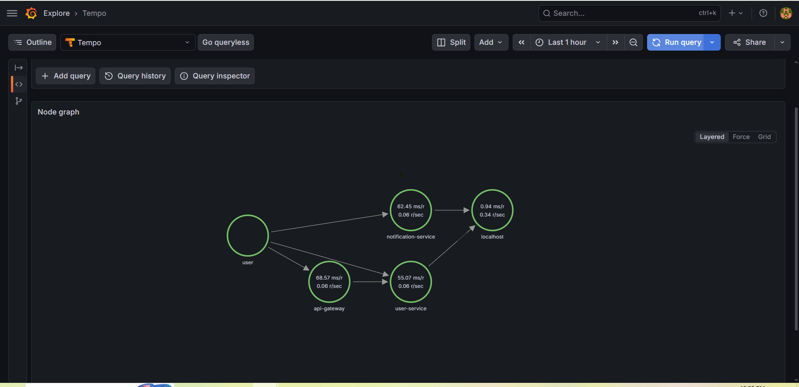

---

## 🔗 Correlated Logging — Trace ↔ Log Navigation

Metrics, traces, and logs are now **cross-linked into a single debugging workflow**. Every structured JSON log line carries the active OpenTelemetry `traceId` and `spanId` (injected into the MDC by the OTel Java Agent — no application code changes), which lets Grafana pivot between Loki and Tempo in both directions:

- **Logs → Traces:** a Loki *derived field* extracts the `traceId` from the log line and renders a **View Trace** link that opens the full distributed trace in Tempo.
- **Traces → Logs:** Tempo's `tracesToLogsV2` link jumps from any span to the matching Loki log stream, time-shifted around the span and filtered by trace ID.

### Correlation Flow

```text
Structured JSON Log (traceId, spanId)          Tempo Trace (spans)
        │                                              │
        │  Loki derived field                          │  tracesToLogsV2
        │  "traceId":"(\w+)" → View Trace              │  span → service logs ±5m
        ▼                                              ▼
   Tempo Trace View   ◄────────────────────►   Loki Log Stream
```
### Trace ↔ Log Correlation

The screenshot below demonstrates bidirectional navigation between Loki and Tempo.

- Logs → Trace using View Trace
- Trace → Logs using Tempo trace links

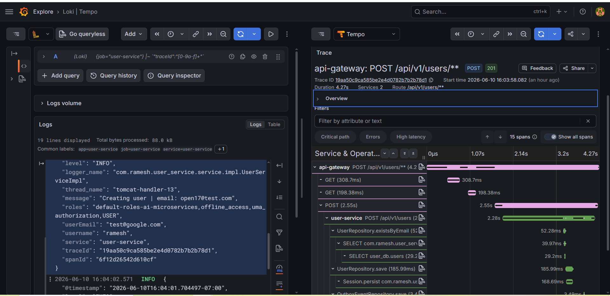

### Configuration

| File | Change | Purpose |
|------|--------|---------|
| `*/logback-spring.xml` | `traceId` / `spanId` MDC fields in the JSON encoder | Embed OTel trace context in every log line |
| `docker/grafana/provisioning/datasources/tempo.yml` | Loki `derivedFields` (regex → internal link → Tempo UID) | Logs → traces navigation |
| `docker/grafana/provisioning/datasources/tempo.yml` | Tempo `tracesToLogsV2` (Loki UID, `service.name` tag mapping, ±5m time shift) | Traces → logs navigation |
| `docker/promtail/promtail-config.yml` | Removed `traceId` from the Promtail `labels` stage | Keep Loki label cardinality bounded — trace IDs are unbounded and would create one stream per request; the derived-field regex matches on **line content**, so no label is needed |

### Usage

In **Explore → Loki**, query for trace-bearing lines and expand a log row — the **View Trace** button appears under *Links*:

```logql
{job="user-service"} |~ `"traceId":"[0-9a-f]+"`
```

In **Explore → Tempo**, open any span and use the **logs** link to jump to the correlated Loki stream.

> **Note:** Kafka consumer thread and outbox-publisher log lines were missing `traceId` context until the OTel agent upgrade (2.28.1, 2026-07-17) which closed the Kafka instrumentation gap. HTTP, JDBC, and Kafka spans are all correlated; the async publish→consume hop is now a single connected trace.

### Features

- OTel `traceId`/`spanId` embedded in structured JSON logs across all services
- One-click pivot from any log line to its distributed trace (Loki → Tempo)
- One-click pivot from any span to its correlated logs (Tempo → Loki)
- Cardinality-safe Loki ingestion (trace IDs kept out of stream labels)
- Provisioned as code — the entire correlation setup lives in version-controlled datasource provisioning

---

## 📊 Production-Grade Grafana Dashboards (Provisioned as Code)

The platform ships **five purpose-built Grafana dashboards**, provisioned entirely from version-controlled JSON — no hand-built panels, no click-ops. Dashboards land automatically in the **AI Microservices Platform** folder on startup and reload within 30 seconds of a file change.

```text
docker/grafana/provisioning/dashboards/
├── dashboards.yml          # file provider (folder, reload interval)
└── json/
    ├── jvm-dashboard.json        # Platform / JVM
    ├── http-dashboard.json       # Platform / HTTP
    ├── kafka-dashboard.json      # Platform / Kafka
    ├── database-dashboard.json   # Platform / Database
    └── business-dashboard.json   # Platform / Business
```

### Dashboard Catalog

| Dashboard | Scope | Key Panels |
|-----------|-------|------------|
| **Platform / JVM** | All services (templated `$service` variable) | Heap used vs max, heap %, GC pause rate & max pause, live threads, thread states, process/system CPU, loaded classes |
| **Platform / HTTP** | All services | Request rate (per service & per endpoint), 4xx/5xx error rate, 5xx error ratio, average & max latency |
| **Platform / Kafka** | Producer + consumer | Consumer throughput (records/s), consumer lag per partition, listener processing rate & latency, producer send rate, rebalances/heartbeats |
| **Platform / Database** | MySQL + PostgreSQL via HikariCP | Active/idle/max connections, pending threads & acquire timeouts, connection acquire/usage time, top-10 repository query rate & latency |
| **Platform / Business** | Domain KPIs | Users created, creation failures by reason, notifications sent/failed/duplicates suppressed, outbox publish rate & failures, outbox backlog, end-to-end funnel |

### Business Metrics (Custom Micrometer Instrumentation)

A metrics audit showed that JVM, HTTP, HikariCP, Spring Data, and Kafka client metrics were already exposed by Micrometer auto-instrumentation, and the transactional outbox was already instrumented (`outbox_*`). Phase 5 adds **only the missing business-layer counters**:

| Metric | Type | Service | Meaning |
|--------|------|---------|---------|
| `users_registered_total` | Counter | user-service | Successfully created users |
| `users_creation_failed_total{reason}` | Counter | user-service | Failed creations, split by `duplicate_email` vs `error` |
| `notifications_sent_total` | Counter | notification-service | Welcome notifications sent |
| `notifications_failed_total` | Counter | notification-service | Notification attempts that threw |
| `notifications_duplicate_total` | Counter | notification-service | Duplicates suppressed by the idempotent consumer (app-level + DB-constraint level) |
| `outbox_published_total` / `outbox_failed_total` | Counter | user-service | Outbox publish outcomes *(pre-existing)* |
| `outbox_pending` / `outbox_processing` / `outbox_failed` | Gauge | user-service | Live outbox backlog by lifecycle state *(pre-existing)* |
| `outbox_publish_duration_seconds` | Timer | user-service | Outbox publish latency *(pre-existing)* |

> **Naming note:** the "users created" counter is exposed as `users_registered_total` rather than `users_created_total` — OpenMetrics reserves the `_created` suffix, and the Prometheus client silently strips it (the metric would surface as `users_total`).

The **Business dashboard's funnel panel** correlates the three counters end-to-end: every `users_registered_total` increment should eventually produce one `outbox_published_total` and one `notifications_sent_total` — divergence between the three lines is an immediate signal of event loss, backlog growth, or consumer failure.

### Dashboard Screenshots

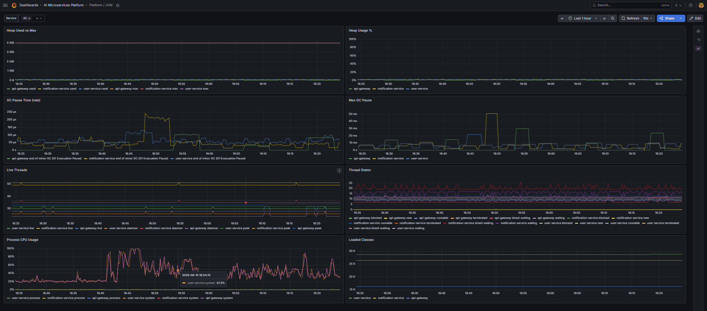
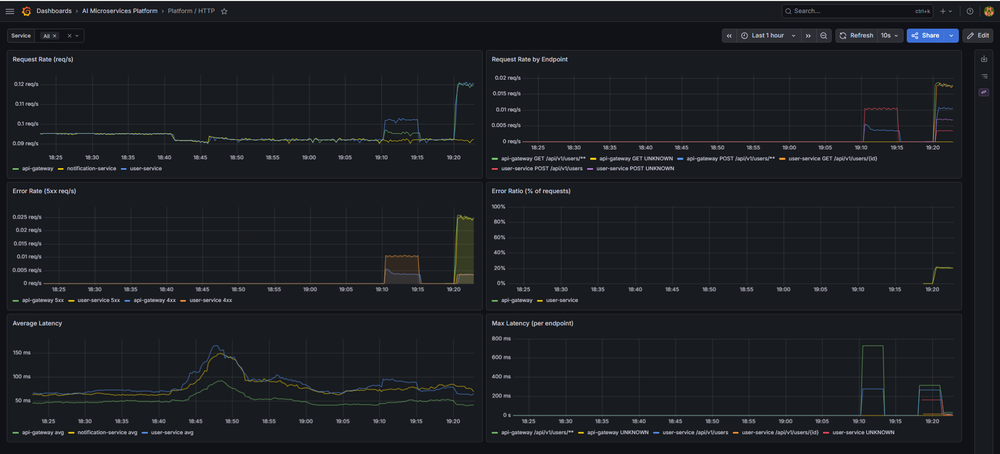
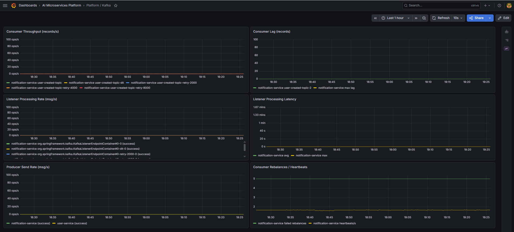
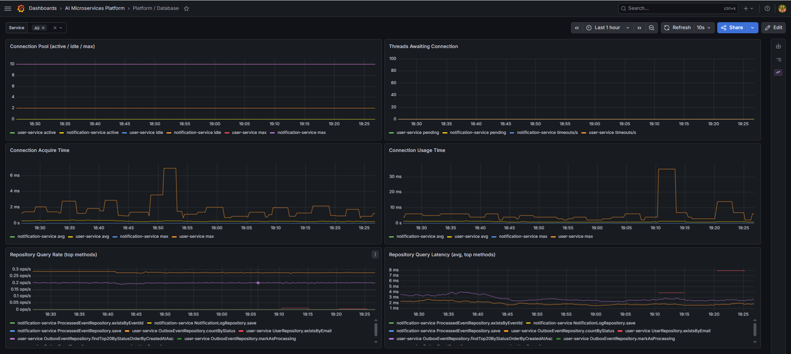
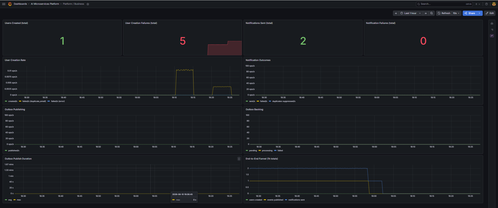

### Verifying the Setup

```bash
# 1. Business counters exposed by the services
curl -s localhost:8080/actuator/prometheus | grep -E "users_(registered|creation_failed)"
curl -s localhost:8081/actuator/prometheus | grep -E "notifications_(sent|failed|duplicate)_total"

# 2. Prometheus has scraped them
curl -s 'localhost:9090/api/v1/query?query=users_registered_total'

# 3. Dashboards provisioned (Grafana API)
curl -s -u admin:admin 'localhost:3000/api/search?tag=platform'
```

Then create a user (and repeat the same request once to trigger the duplicate-email path) and watch the Business dashboard panels move:

```bash
curl -X POST localhost:8082/api/v1/users -H "Authorization: Bearer $TOKEN" \
  -H "Content-Type: application/json" \
  -d '{"email":"demo@test.com","firstName":"Demo","lastName":"User"}'
```

---

## 🛡 Resilience & Reliability

The platform degrades gracefully and recovers automatically under three failure classes: **downstream service outages** (circuit breakers + fallbacks), **traffic surges** (edge rate limiting), and **message-processing failures** (layered retries ending in a dead letter topic). Every protection emits metrics into the existing Prometheus/Grafana stack.

### Resilience Architecture

```text
                 Client
                   │
                   ▼
        ┌─────────────────────────────┐
        │   API Gateway               │
        │   ① RateLimitFilter (429)   │  Resilience4j RateLimiter — 20 req/s,
        │   ② JWT validation          │  runs BEFORE security: floods are shed
        │   ③ CircuitBreaker filter   │  userServiceCB / notificationServiceCB
        │      └─ fallback → 503      │  fail-fast + Retry-After when open
        │   ④ Retry filter (GET 5xx)  │  idempotent reads only
        └──────────┬──────────────────┘
                   ▼
        user-service ──► outbox table ──► scheduled publisher
                                          ⑤ transient failure → PENDING again
                                            (outbox_retried_total, max 5 → FAILED)
                                          │
                                          ▼ Kafka
        notification-service  ⑥ @RetryableTopic: retry-2000 → retry-4000 → retry-8000
                              ⑦ exhausted → DLT → @DltHandler
                                 (notifications_dlt_total + dead_letter_events row
                                  with full actor/audit context)
```

### Protection Layers

| Layer | Mechanism | Configuration | Failure Behavior |
|-------|-----------|---------------|------------------|
| Gateway → downstream | Resilience4j circuit breakers (`userServiceCB`, `notificationServiceCB`) | 10-call sliding window, opens at 50% failures (min 5 calls), 10s open, auto half-open with 3 probes, 5s time limit | Fast 503 JSON fallback with `Retry-After`; open breaker rejects without network calls |
| Public API edge | Resilience4j rate limiter (`public-api`) | 20 req/s, zero wait | 429 + `Retry-After: 1`; runs before JWT validation so floods don't burn crypto cycles; actuator exempt so probes/scrapes never throttle |
| Gateway reads | Route `Retry` filter | 3 attempts, `SERVER_ERROR` series, **GET only** | Transparent retry of idempotent reads; writes are never retried at the edge (outbox owns write reliability) |
| Outbox publishing | Persistent state-machine retry | Max 5 attempts, then `FAILED` | Event returns to `PENDING` (`outbox_retried_total`); broker outages never lose events |
| Kafka consumption | `@RetryableTopic` non-blocking retries | 4 attempts, 2s/4s/8s exponential backoff | Main topic stays unblocked while failures replay on retry topics |
| Poison messages | `@DltHandler` + `dead_letter_events` | `ALWAYS_RETRY_ON_ERROR` — a failing DLT handler re-publishes the record to the DLT until the audit insert succeeds | `notifications_dlt_total` + durable row with actor context for replay/triage |
| Probes | Actuator health groups | `/actuator/health/liveness`, `/actuator/health/readiness` on all services | Kubernetes-ready; readiness intentionally excludes external deps (Spring default) to avoid cascading restarts |

### Resilience Metrics

| Metric | Source | Meaning |
|--------|--------|---------|
| `resilience4j_circuitbreaker_state{state}` | gateway | 1 on the active state (closed/open/half_open) per breaker |
| `resilience4j_circuitbreaker_calls_seconds_count{kind}` | gateway | Calls by outcome (successful/failed/ignored) |
| `resilience4j_circuitbreaker_not_permitted_calls_total` | gateway | Requests rejected while the breaker was open |
| `resilience4j_ratelimiter_available_permissions` | gateway | Remaining tokens in the current 1s window |
| `outbox_retried_total` | user-service | Transient publish failures sent back to `PENDING` |
| `spring_kafka_listener_seconds_count{name=~".*retry.*"}` | notification-service | Per-retry-topic delivery attempts |
| `notifications_dlt_total` | notification-service | Events that exhausted all retries |
| `notifications_failed_total` / `outbox_failed_total` | both | Permanent failures by layer |

All of the above are visualized on the provisioned **Platform / Resilience** dashboard (`docker/grafana/provisioning/dashboards/json/resilience-dashboard.json`).

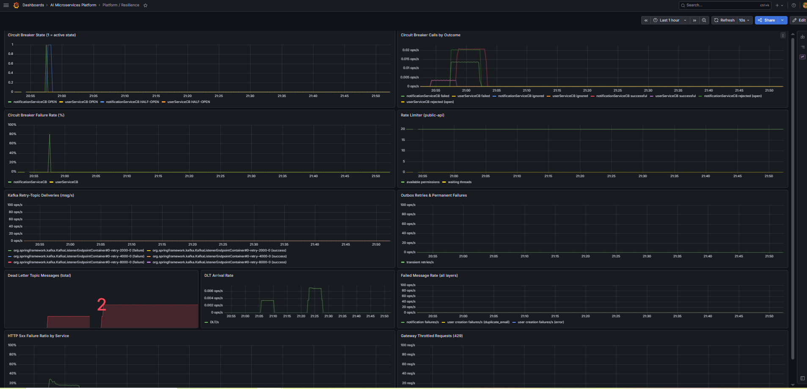

### Demonstrated Failure Scenarios

All three scenarios were executed against the running platform and verified through Prometheus:

**1. Notification service unavailable (circuit breaker):** with notification-service stopped, 10 authenticated calls through the gateway all received the fast 503 fallback — the first 4 failures tripped the breaker, the remaining 6 were rejected without a network attempt (`not_permitted_calls_total = 6`, `state{open} = 1`). After restart, the breaker half-opened in 10s, probe calls succeeded, and it closed automatically.

**2. Kafka consumer failure → retry topics → DLT:** with the notification database taken offline, a published event failed on the main topic, replayed across `retry-2000` → `retry-4000` → `retry-8000` (visible per-topic in listener metrics), then landed in the DLT (`notifications_dlt_total = 1`).

**3. Database transient failure (self-healing — and a real bug found):** the first run of this scenario exposed a genuine gap: under the original `DltStrategy.FAIL_ON_ERROR`, a DLT handler failing against a downed database was **not retried** — Spring Kafka logged *"won't be retried. No further action will be taken with this record"* and the audit row was permanently lost. The strategy was switched to `ALWAYS_RETRY_ON_ERROR` and the scenario re-run: the failed DLT record was re-published to the DLT, and once the database returned, the `dead_letter_events` audit row (with actor context) persisted automatically — no message loss, no manual intervention. The `notifications_dlt_total` metric is deliberately incremented *before* the audit insert so the alerting signal survives even while persistence is failing.

### Verifying the Setup

```bash
# Probes (all services)
curl localhost:8080/actuator/health/readiness
curl localhost:8082/actuator/health/liveness

# Circuit breaker state + rate limiter
curl -s localhost:8082/actuator/prometheus | grep resilience4j_circuitbreaker_state
curl -s localhost:8082/actuator/prometheus | grep resilience4j_ratelimiter

# Trip the rate limiter (40 rapid requests → mix of passed + 429)
curl -s -o /dev/null -w "%{http_code}\n" "http://localhost:8082/api/v1/users?burst=[1-40]" | sort | uniq -c

# DLT / retry counters
curl -s localhost:8081/actuator/prometheus | grep -E "notifications_dlt_total|notifications_failed_total"
curl -s localhost:8080/actuator/prometheus | grep outbox_retried_total

# Verified in Prometheus
curl -s 'localhost:9090/api/v1/query?query=resilience4j_circuitbreaker_state{state="open"}'
```

---

## 🎯 SLO-Based Alerting & Observability Blind-Spot Taxonomy

The platform defines per-service Service Level Indicators (SLIs) and Objectives (SLOs), implements a full Prometheus alerting stack, and verifies every alert path by controlled failure injection before trusting it.

### SLI Catalog (excerpt)

| SLI | Service | Target | Metric |
|-----|---------|--------|--------|
| Gateway availability | api-gateway | ≥ 99.9% | `1 - rate(5xx) / rate(all)` |
| Gateway p99 latency | api-gateway | ≤ 500ms | `http_server_requests_seconds` histogram |
| Pipeline consumption | notification-service | Lag = 0 within 5m | Both-sides flow comparison (absent-safe) |
| Outbox backlog age | user-service | Oldest PENDING ≤ 300s | `outbox_oldest_pending_age_seconds` |
| Terminal event loss | user-service | 0 FAILED rows | `outbox_failed` gauge |

### Alerting Strategy — Multi-Window Burn Rates

Rather than threshold alerts ("5xx > N"), the platform uses **Google SRE-style burn-rate alerts**: error budget consumption trajectory, not raw values.

| Alert | Window | Multiplier | Severity |
|-------|--------|------------|----------|
| `AvailabilityFastBurn` | 5m AND 1h | 14.4× | page |
| `AvailabilitySlowBurn` | 30m AND 6h | 6× | ticket |
| `OutboxBacklogAgeHigh` | for: 5m | — | page |
| `OutboxPublishTerminalFailure` | for: 2m | — | page |
| `PipelineConsumptionStalled` | for: 5m | — | page |
| `KafkaBrokerConsumerLagHigh` | for: 5m | — | warning |

### Blind-Spot Taxonomy (Empirically Discovered)

Three classes of structurally invisible failures were identified and remediated through live injection testing:

| Class | Description | Detection |
|-------|-------------|-----------|
| **Metrics that decay** | `records_lag_max` → NaN when consumer stops fetching — no value, no alert fires | Both-sides pipeline flow counter comparison (absent-safe `unless` semantics) |
| **Metrics that vanish** | Dead scrape target silences every rule for that service | `TargetDown` backstop |
| **Terminal states nobody queries** | Outbox rows marked `FAILED` after retry exhaustion — silent event loss, row sits in DB unmonitored | `outbox_failed` gauge + `OutboxPublishTerminalFailure` (severity: page) |

Every alert in the platform has been **live-fire verified**: injected failure → alert pending at threshold → fires at confirmation window → routed to Alertmanager with runbook → auto-resolved on recovery. An untested alert is a hypothesis, not a guarantee.

### SLO Baseline (measured 2026-07-17)

1,000 JWT-authenticated requests through the gateway at ~14 req/s (70 seconds):
- **Availability SLI:** 1.0 (zero 5xx/4xx)
- **Latency p99:** 186ms (gateway) / 177ms (user-service)
- **Burst suppression verified:** 720-row backlog took two alerts to *pending*; drained before either fired — system correctly distinguished a burst from an incident

---

## ☸️ Kubernetes Deployment

The platform runs in a local **kind cluster** (Kubernetes 1.31.4 LTS) using **Kustomize** base/overlays. All manifests are in `k8s/base/`.

### What Runs in the Cluster

| Component | Image | Notes |
|-----------|-------|-------|
| user-service | `ai-platform/user-service:*` | Layered Boot 4, OTel agent, uid-1001 |
| notification-service | `ai-platform/notification-service:*` | Same; `AI_SERVICE_URL` injected |
| api-gateway | `ai-platform/api-gateway:*` | Same |
| ai-service | `ai-platform/ai-service:1.0.0` | Spring AI 2.0, PGVector |
| kafka | `confluentinc/cp-kafka:7.5.0` | KRaft mode, `enableServiceLinks: false` |
| schema-registry | `confluentinc/cp-schema-registry:7.5.0` | `strategy: Recreate` (single-replica rolling-update is fatal) |
| mysql | `mysql:8.0` | User service DB |
| postgres | `pgvector/pgvector:pg17` | notification + ai databases |
| keycloak | `quay.io/keycloak/keycloak:25.0` | Realm auto-imported from `docker/keycloak/ai-microservices-realm.json` |
| kafka-exporter | `danielqsj/kafka-exporter:v1.7.0` | Broker-side consumer lag |
| kube-prometheus-stack | Helm 88.x | Prometheus Operator + Grafana + Alertmanager |
| Tempo | Helm 2.9.0 | Distributed tracing + service-graph |
| Loki | Helm 3.6.11 | Log aggregation (caches disabled for single-node) |
| Promtail | Helm 3.5.1 | DaemonSet log shipping |

### Apply the Stack

```bash
# Create the cluster
kind create cluster --name ai-platform --config k8s/kind-config.yaml

# Install in-cluster observability (Helm)
helm upgrade --install kube-prometheus-stack prometheus-community/kube-prometheus-stack \
  -n monitoring --create-namespace -f k8s/helm/kube-prometheus-stack-values.yaml

helm upgrade --install tempo grafana/tempo-distributed \
  -n monitoring -f k8s/helm/tempo-values.yaml

helm upgrade --install loki grafana/loki \
  -n monitoring -f k8s/helm/loki-values.yaml

helm upgrade --install promtail grafana/promtail \
  -n monitoring -f k8s/helm/promtail-values.yaml

# Apply platform services
kubectl apply -k k8s/base/
```

### Key Kubernetes Engineering Decisions

Five structural failure modes were discovered and resolved during cluster bringup — each with a non-obvious root cause:

1. **`enableServiceLinks: false` on Confluent images** — K8s injects a `KAFKA_PORT=tcp://...` env var into every pod; Confluent images interpret `KAFKA_*` vars as broker config, crashing the broker.
2. **`cpu: 1m` explicit requests** — K8s sets `requests.cpu = limits.cpu` when requests are omitted; 8 pods × 500m = 4000m > 2000m allocatable → all pods Pending.
3. **`timeoutSeconds: 5` on all probes** — default 1s times out under WSL2/Docker Desktop CPU contention; MySQL Not-Ready cascades into HikariCP fast-fail in dependent services.
4. **Keycloak readiness on `/realms/<realm>:8080`** — `start-dev` only opens port 8080 (not the management port 9000 used in production mode); `/health/ready` returns 404; the realm endpoint is the correct readiness signal.
5. **Schema Registry `strategy: Recreate`** — a rolling update creates two concurrent pods in the same consumer group, causing a `LEADER_NOT_AVAILABLE` rebalance that kills the `KafkaGroupLeaderElector` thread permanently in a single-replica setup.

---

## 🤖 AI Service (Spring AI + Ollama + PGVector)

The `ai-service` module adds an LLM enrichment stage to the event-processing pipeline. It is designed as a **non-blocking, non-fatal dependency**: if it is unavailable, the Kafka consumer falls back silently and event processing continues unaffected.

### Architecture

```text
notification-service (Kafka consumer)
      │
      │  POST /api/v1/ai/enrich
      │  { userId, userName, userEmail, eventType }
      ▼
ai-service (:8083)
      │
      ├── OllamaChatModel (llama3.2 via Ollama :11434)
      │     "Generate a personalized 2-sentence welcome for {name}..."
      │
      └── Response: { enrichedMessage, modelUsed, processingTimeMs }
            ↓ (on any failure: timeout, 5xx, network error)
      AiEnrichmentClient.orElse("Welcome! Your account has been created.")
```

### Non-Fatal Design (ADR-020)

`AiEnrichmentClient` wraps every call in try-catch and returns `Optional<String>`. A 5-second connect / 30-second read timeout prevents blocking the Kafka consumer thread beyond a bounded window. The caller uses `.orElse(FALLBACK_MESSAGE)`, so Kafka never retries and never DLT's due to AI latency or unavailability.

```java
// The entire enrichment path — if anything throws, the consumer still ACKs
String message = aiEnrichmentClient
    .enrich(userId, userName, email)
    .orElse(FALLBACK_MESSAGE);
```

### Services & Ports

| Service | Port | Notes |
|---------|------|-------|
| ai-service | 8083 | `POST /api/v1/ai/enrich`, `GET /actuator/health` |
| Ollama | 11434 | Local LLM runtime; load models via `ollama pull` |

### Resource Requirements

| Mode | RAM requirement |
|------|----------------|
| ai-service only (no Ollama) | 256MB — runs fine, falls back on every call |
| ai-service + Ollama + llama3.2 | ≥ 8GB Docker Desktop / kind node |
| nomic-embed-text (embeddings) | ~500MB additional |

See [`ai-service/README.md`](ai-service/README.md) for setup, local run, and model pull instructions.

---

## 🚀 Running Locally

### Prerequisites

```bash
# 1. Install Avro schemas to local ~/.m2 (required before any service build)
cd common-schema && mvn clean install
```

### Option A — Docker Compose (full stack)

```bash
cd docker && docker-compose up -d
# All services + infrastructure + observability in ~15 containers
# Wait ~4 min for Schema Registry and ~8-20 min for Keycloak on first start
```

### Option B — Gradle bootRun (local development)

```bash
# Start infra first (Kafka, Schema Registry, Keycloak, observability)
cd docker && docker-compose up -d

# Then start services
cd user-service && ./gradlew bootRun        # :8080
cd notification-service && ./gradlew bootRun # :8081
cd api-gateway && ./gradlew bootRun          # :8082
cd ai-service && ./gradlew bootRun           # :8083 (requires Ollama running separately)
```

### Option C — Kubernetes (kind cluster)

```bash
# Requires Docker Desktop ≥ 8GB for Ollama; ≥ 4GB for everything else
kind create cluster --name ai-platform
kubectl apply -k k8s/base/

# Get a token (from inside the cluster — avoids Keycloak iss-claim mismatch)
kubectl exec deploy/user-service -n microservices -- sh -c '
  TOKEN=$(curl -s -X POST http://keycloak:8080/realms/ai-microservices/protocol/openid-connect/token \
    -d "grant_type=password&client_id=api-gateway&username=resilience-demo&password=LoadBase2026!" \
    | sed -n "s/.*\"access_token\":\"\([^\"]*\)\".*/\1/p")
  curl -s -w "\nHTTP %{http_code}" -X POST http://api-gateway:8082/api/v1/users \
    -H "Content-Type: application/json" \
    -H "Authorization: Bearer $TOKEN" \
    -d "{\"firstName\":\"Test\",\"lastName\":\"User\",\"email\":\"test@example.com\"}"'
```

### Test credentials (baked into realm JSON)

| Field | Value |
|-------|-------|
| Username | `resilience-demo` |
| Password | `LoadBase2026!` |
| Client ID | `api-gateway` (public, direct-access grants) |
| Realm | `ai-microservices` |

---

## 📌 Current Status

### Epoch A — Event-Driven Foundation
- ✅ Event publishing (User Service → Kafka)
- ✅ Event consumption (Notification Service, idempotent)
- ✅ Avro schema integration (Confluent Schema Registry)
- ✅ Kafka in KRaft mode (no ZooKeeper)
- ✅ Retry topics + Dead Letter Topic with `@RetryableTopic` / `@DltHandler`
- ✅ Idempotent consumer (processed-event table + DB unique constraint as final arbiter)
- ✅ Heterogeneous persistence: MySQL (Liquibase) + PostgreSQL (Flyway), `ddl-auto=none`

### Epoch B — Observability & Reliability
- ✅ Spring Boot Actuator + Micrometer + Prometheus scraping
- ✅ Grafana dashboards: JVM, HTTP, Kafka, Database, Business (all provisioned as code)
- ✅ Business KPI counters: users registered/failed, notifications sent/failed/duplicate suppressed
- ✅ End-to-end business funnel panel (users → outbox → notifications)
- ✅ Structured JSON logging with `traceId`/`spanId` enrichment (OTel MDC injection)
- ✅ Centralized log aggregation: Loki + Promtail, cardinality-safe ingestion
- ✅ Transactional Outbox Pattern (PENDING → PROCESSING → PUBLISHED, retry-safe)
- ✅ Outbox health metrics + operational dashboard

### Epoch C — Security & Identity
- ✅ Spring Cloud Gateway MVC — centralized entry point, routing, metrics
- ✅ Keycloak OAuth2/JWT authentication (realm-as-code, auto-imported)
- ✅ Role-Based Access Control (USER / ADMIN)
- ✅ Anti-spoofing: gateway unconditionally overwrites `X-User-*` headers from verified JWT
- ✅ End-to-end identity propagation (Gateway → services → Kafka headers → DLT rows)
- ✅ Actor context persisted transactionally with the outbox event for async audit attribution

### Epoch D — Distributed Tracing & Correlation
- ✅ OpenTelemetry Java Agent 2.28.1 (zero code changes: HTTP, JDBC, Kafka spans all instrumented)
- ✅ OTLP trace export to Grafana Tempo
- ✅ Full service topology in Tempo Service Graph — including the async Kafka hop (resolved 2026-07-17)
- ✅ Bidirectional Tempo↔Loki correlation (Logs → Trace via derived fields; Trace → Logs via `tracesToLogsV2`)
- ✅ Resilience4j circuit breakers + rate limiter (20 req/s) + retry filter on gateway
- ✅ Self-healing DLT reprocessor (scheduled idempotent replay, exponential backoff, poison cap)
- ✅ Platform / Resilience dashboard; all failure scenarios live-demonstrated

### Epoch E — SLOs & Production Alerting
- ✅ Per-service SLI definitions: availability, latency, consumer lag, outbox age, terminal failures
- ✅ Prometheus recording rules (SLI ratios, precomputed)
- ✅ Multi-window burn-rate alerts (14.4× fast / 6× slow for availability)
- ✅ Pipeline-stall alert (absent-safe both-sides flow — survives NaN consumer-lag decay)
- ✅ `OutboxPublishTerminalFailure` alert (terminal FAILED rows — silent event loss class)
- ✅ `TargetDown` backstop (scrape-target death silences all other rules)
- ✅ Alertmanager wired and routing alerts to Prometheus
- ✅ Runbooks per alert under `docs/runbooks/`
- ✅ SLO overview dashboard (10 panels: SLI compliance, error budget, burn rates, terminal watchdogs)
- ✅ Every alert live-fire verified by controlled failure injection
- ✅ SLO baseline: 1,000 req at ~14 req/s — availability 1.0, p99 186ms, zero errors, zero alerts fired

### Epoch F — Kubernetes & In-Cluster Observability
- ✅ Layered Dockerfiles: Boot 4 tools-jarmode, non-root uid-1001, OTel agent staged via Gradle
- ✅ All infra endpoints env-driven; Keycloak issuer-URI/JWK-set-URI independently overridable
- ✅ Full Docker Compose stack (15 containers) smoke-verified end-to-end
- ✅ kind cluster (Kubernetes 1.31.4 LTS) — all services running via Kustomize base
- ✅ kube-prometheus-stack + Tempo + Loki + Promtail in-cluster; ServiceMonitor CRDs for all services
- ✅ kafka-exporter v1.7.0: broker-side consumer lag (closes NaN-metric blind spot)
- ✅ `KafkaBrokerConsumerLagHigh` PrometheusRule — 11 rules total in-cluster
- ✅ Phase 8 exit gate: `OutboxPublishTerminalFailure` fired from a real condition, AM delivered, auto-resolved

### Phase 9 — AI Service (in progress)
- ✅ `ai-service` module: Spring AI 2.0 + Ollama (llama3.2) + PGVector
- ✅ `POST /api/v1/ai/enrich` endpoint: generates personalized notification content via local LLM
- ✅ Non-fatal enrichment client in notification-service (5s/30s timeouts, `Optional<String>` fallback)
- ✅ Flyway V5 migration: `message TEXT` column on `notification_log`
- ✅ Docker Compose wiring: Ollama + ai-service + `ensure-ai-db` init
- ✅ Kubernetes manifests: Ollama StatefulSet + model-pull Job + ai-service Deployment/Service/ServiceMonitor
- ✅ End-to-end smoke test in kind: HTTP 201 → Kafka consumed → AI enrichment → notification logged
- 🚧 Ollama in-cluster activation (requires Docker Desktop ≥ 8GB; manifests committed, apply deferred)
- 🚧 OTel spans for LLM calls (model latency visible in Tempo)
- 🚧 notification-service Docker image rebuild with Phase 9 code baked in

### Roadmap
- 🔲 Phase 10 — Terraform + AWS EKS deployment
- 🔲 Phase 11 — GitOps with ArgoCD
- 🔲 Phase 12 — Chaos engineering (fault injection + game-day reports)

---

## 🧠 Engineering Findings & Non-Obvious Decisions

- **The outbox pattern alone is not enough.** After 5 publish retries, rows become terminal FAILED — silently. No retry, no alert, no visibility. The `outbox_failed` gauge existed, but no rule consumed it. The missing piece was not code — it was an alert. Lesson: a metric nobody alerts on is a decoration.
- **Client-side Kafka lag metrics go blind on a dead consumer.** `records_lag_max` decays to NaN when a consumer stops fetching (it needs to fetch to report lag). The fix is not a better lag metric — it’s comparing event flow on both sides of the pipeline with absent-safe `unless` semantics.
- **An untested alert is a hypothesis.** Every alert in this platform was verified by controlled failure injection before being trusted. Build time is 30 minutes; an alert that doesn’t fire when it should costs hours of incident response.
- **Kafka spans were missing for 6 weeks due to a version skew, not a bug.** Spring Boot 4 upgraded to kafka-clients 4.x; the OTel agent (2.11.0) predated that version and skipped instrumentation silently. The correct response was to verify on the latest agent release *before* filing an upstream issue — which showed the gap was version-specific and already resolved.
- **PostgreSQL `docker-entrypoint-initdb.d/` is a one-shot mechanism.** It only fires on the first start against an empty volume. For Kubernetes, where volumes persist across pod restarts and cluster recreations, a Kubernetes init container that runs idempotently on every pod start is the reliable pattern.
- **Kind’s `ctr images import --all-platforms` fails for multi-arch images.** When only one platform blob is locally cached, it cannot find the manifests for the other platforms and fails with a content-digest error. The fix is to bypass kind’s wrapper and pipe directly into containerd without the `--all-platforms` flag.
- **Keycloak in `start-dev` mode issues the `iss` claim based on the incoming request URL.** Port-forwarding to a different port changes the claim, breaking JWT validation at the gateway. The correct K8s testing pattern is to obtain tokens from inside the cluster where the internal DNS name matches the configured issuer URI.

---

## 📈 Roadmap

| Phase | Focus | Status |
|-------|-------|--------|
| 1–6 | Event-driven foundation, observability, security, identity, tracing, resilience | ✅ Complete |
| 7 | SLOs, alerting, multi-window burn rates, Alertmanager, live-fire verification | ✅ Complete |
| 8 | Kubernetes, Dockerfiles, Kustomize, in-cluster observability stack | ✅ Complete |
| 9 | AI service (Spring AI + Ollama + PGVector), AI enrichment pipeline | 🚧 In Progress |
| 10 | Terraform — VPC, EKS, RDS, MSK modules | Planned |
| 11 | GitOps — ArgoCD continuous deployment | Planned |
| 12 | Chaos engineering — fault injection, game-day reports | Planned |

**Standing improvements:**
- Real notification channel (email via AWS SES / SendGrid) to replace log-simulated delivery
- Service-to-service mTLS before cloud deployment
- Virtual Threads load-test: empirical throughput comparison vs platform threads

---

### Example Log Queries

Trace IDs are intentionally **not** Loki stream labels (unbounded cardinality); they live in the log line content and are queried with line filters:

```logql
{service="user-service"} |= `"traceId":"7de94c15e1a7f24edc23856f1a67064c"`
```

```logql
{service=~"user-service|notification-service"} |~ `"traceId":"[0-9a-f]+"`
```

These queries enable cross-service distributed request tracing through Kafka workflows using centralized log aggregation — and each matching line links directly to its Tempo trace via the **View Trace** derived field.

## 🤝 Contributing

This project demonstrates modern distributed systems architecture and operational engineering patterns using event-driven microservices.

Feel free to explore, fork, and improve!
